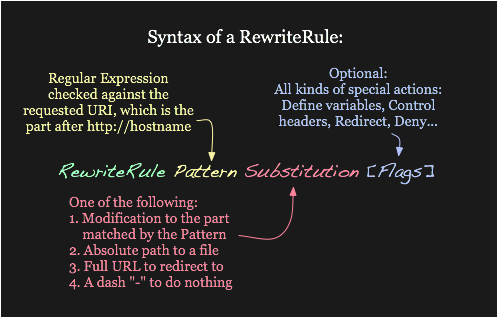
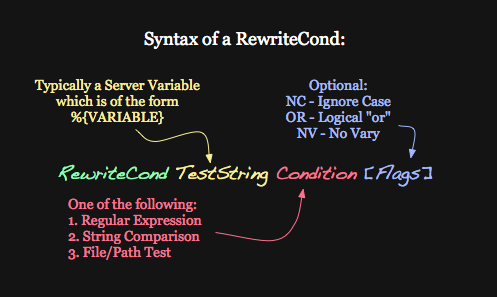

Este es un módulo muy potente de Apache que permite reescribir la petición del usuario para modificar la URL que solicita de forma transparente al usuario.

Ejemplos de uso:
- **No más URLs con .php:** El usuario solicita `http://example.com/app` y Apache hace como su hubiese solicitado `http://example.com/app.php`
- **URLs limpia:** El usuario solicita `http://example.com/suma/4/5` y Apache reesccribe a `http://example.com/suma.php?x=4&y=5`
- Si hemos reestructurado nuestro código interno, nos permite mantener las mismas URLs antiguas aunque los directorios internos hayan cambiado.
- Proveer contenido diferente según el user-agent, o según el país...

Documentación oficial:
- [Apache mod_rewrite Introduction](https://httpd.apache.org/docs/2.4/rewrite/intro.html)  ← Incluye ejemplos visuales


## Habilitar rewrite

Este módulo es posible que no esté habilitado por defecto. Recordamos la gestión de módulos de Apache:
```bash
$ # Listar módulos disponibles:
$ ls /etc/apache2/mods-available/
$
$ # Listar módulos habilitados:
$ ls /etc/apache2/mods-enabled/
$
$ # Preguntar a Apache por sus módulos habilitados (similar al anterior)
$ apachectl -M
$
$ # Habilitar el módulo Rewrite
$ sudo a2enmod rewrite
$ sudo systemctl restart apache2.service
```

## Sintaxis general

Sintaxis de las reglas rewrite (imagen de la documentación oficial, enlazada antes):



La parte de **sustitución** puede ser de tres tipos:

```apache
<VirtualHost *:80>
  # ...

  # 1. Ruta completa a un recurso. Mismo comportamiento que un Alias:
  RewriteRule ^/games /usr/local/games/web/puzzles.html

  # Ruta relativa al DocumentRoot:
  RewriteRule ^/games$ /puzzles.html

  # URL a sitio externo, similar a un redirect:
  RewriteRule "^/product/view$" "http://site2.example.com/seeproduct.html" [R]

  # Se pueden poner comillas o no ponerlas, el resultado es el mismo.
</VirtualHost>
```

## Pattern matching

El campo del **patrón de búsqueda** contiene una **expresión regular** con símbolos especiales (ver la lista completa en la [documentación oficial](https://httpd.apache.org/docs/2.4/rewrite/intro.html)):

| Símbolo | Descripción |
|----|-----|
| `^` | Indica comienzo de la URL |
| `$` | Indica final de la URL |

Siempre que el patrón haga _match_ con la URL del cliente, se aplicará la reescritura. Ejemplos:
```apache
RewriteRule ^/games$  /puzzles.html
# Se indican los contenidos de comienzo a fin.
# Únicamente hace match con http://example.com/games

RewriteRule ^/games  /puzzles.html
# Sólo indica el comienzo, pero puede finalizar de cualquier modo:
# https://example.com/games             Sí hace match
# https://example.com/games/            Sí hace match
# https://example.com/games/cosa        Sí hace match
# https://example.com/gamestop          Sí hace match
# https://example.com/cosa/games        No hace match

RewriteRule /games$  /puzzles.html
# Sólo indica el final, pero puede comenzar de cualquier modo:
# https://example.com/games             Sí hace match
# https://example.com/games/            No hace match
# https://example.com/games/cosa        No hace match
# https://example.com/gamestop          No hace match
# https://example.com/cosa/games        Sí hace match

RewriteRule games  /puzzles.html
# Hace match siempre que incluya la palabra "games" en cualquier sitio
# https://example.com/games/cosa        Sí hace match
# https://example.com/mygamestop        Sí hace match
# https://example.com/cosa/games        Sí hace match
```


**Ojo con la barra final**

Hay una diferencia importante entre acabar con barra o no:
```text
http://example.com/unacosa
http://example.com/unacosa/
```
Si no acaba con barra, se trata como si fuese un fichero. La barra indica que se maneja al estilo de un directorio (o su index.hml interno).


Para capturar partes de la URL y reestructurarla de forma más compleja:
| Símbolo | Descripción |
|----|-----|
| `()` | Captura contenido |
| `.` | Hace match con cualquier carácter |
| `*` | El match previo debe ocurrir cero o más veces |
| `+` | El match previo debe ocurrir una o más veces |
| `?` | El match previo es opcional |
| `|` | Dentro de paréntesis separa posibles capturas mediante OR. |
| `a-z` | Match con cualquier letra minúscula. |
| `A-Z` | Match con cualquier letra mayúscula. |
| `0-9` | Match con cualquier número de un solo carácter. |
| `\` | Escapa el siguiente carácter. |
| `[]` | Match con cualquiera de los caracteres que vayan dentro. |
| `[^]` | Negación del anterior. |

```apache
RewriteRule ^/c.t$  /puzzles.html
# Hace match si la URL incluye en cualquier sitio las palabras: cat, cut, cxt...
# http://example.com/ct      No hace match
# http://example.com/caat    No hace match

RewriteRule ^/c.*t$  /puzzles.html
# Hace match si la URL incluye en cualquier sitio las palabras.
# http://example.com/ct        Sí hace match
# http://example.com/context   Sí hace match
# http://example.com/contex    No hace match

RewriteRule ^/cosi?t?a$  /puzzles.html
# La letra i y la t son opcionales.
# http://example.com/cosita    Sí hace match
# http://example.com/cosia     Sí hace match
# http://example.com/costa     Sí hace match
# http://example.com/cosa      Sí hace match
# http://example.com/cosilla   No hace match

RewriteRule ^/c[aei]t$  /puzzles.html
# http://example.com/cat    Sí hace match
# http://example.com/cet    Sí hace match
# http://example.com/cit    Sí hace match
# http://example.com/cot    No hace match

RewriteRule ^/c[a-z]*ta?$  /puzzles.html
# Match con cualquier letra de a a z minúsculas cero o más veces 
# con una a opcional final.
# http://example.com/ct        Sí hace match
# http://example.com/cta       Sí hace match
# http://example.com/cat       Sí hace match
# http://example.com/carta     Sí hace match
# http://example.com/cartas    No hace match

RewriteRule ^/c[^a]t$  /puzzles.html
# http://example.com/cat    No hace match
# http://example.com/cet    Sí hace match
# http://example.com/cit    Sí hace match
# http://example.com/cot    Sí hace match

RewriteRule ^/[a-zA-Z]+$  /puzzles.html
# Acepta letras mayúsculas y minúsculas en cualquier orden
# http://example.com/       No hace match
# http://example.com/hey    Sí hace match
# http://example.com/hEy    Sí hace match

RewriteRule ^/[a-zA-Z0-9]+$  /puzzles.html
# Acepta letras mayúsculas, minúsculas y números en cualquier orden
# http://example.com/123CUATRO    Sí hace match
# http://example.com/c0s4         Sí hace match
```

El backslash `\` permite _escapar_ el siguiente carácter que le siga para que por ejemplo un punto se interprete no para hacer match con cualquier carácter sino para usarlo como el carácter punto. Por ejemplo:
```apache
RewriteRule ^/imagen\.jpg$ /imagen.png
# El backslash hace que el punto no se use para hacer matching,
# sino como un simple carácter punto.
# http://example.com/imagen.jpg    Sí hace match
# http://example.com/imagenjpg     No hace match
# http://example.com/imagen-jpg    No hace match
```

## Capturar matches
Con los paréntesis `()` podemos capturar texto en el patrón y usarlo en la sustitución como variables.

Ejemplo sencillo:
```apache
RewriteRule ^/vegetales/(.*) /vegetales.php?$1
# Envía a php todo lo que siga tras vegetales/
```

Sería mejor escribir lo siguiente:
```apache
RewriteRule ^/vegetables/([^/]*) /vegetables.php?$1
# Envía a php lo que haya tras vegetables hasta la primera barra /
```


Otro ejemplo más elaborado:
```apache
RewriteRule ^/suma/([0-9]+)/([0-9]+)$ /suma.php&x=$1&y=$2
```

Pruébalo con este código de ejemplo [suma.php](suma.php.txt).

La barra vertical permite escribir diferentes palabras posibles a capturar:

```apache
RewriteRule ^/(suma|add|plus|\+)/([0-9]+)/([0-9]+)$ /suma.php&x=$2&y=$3
# Permite al usuario entrar mediante:
# http://example.com/suma/3/5
# http://example.com/add/3/5
# http://example.com/plus/3/5
# http://example.com/+/3/5
```

En el caso anterior era obligatoria la existencia de dos números como parámetros separados por una barra `/`. Podemos hacer también que haya parámetros opcionales como en este ejemplo:
```
http://example.com/pets
http://example.com/pets/mammals
http://example.com/pets/mammals/dogs
http://example.com/pets/mammals/dogs/shorthaired
```

La regla podría quedar del siguiente modo:
```apache
RewriteRule ^/pets/?([a-z]*)/?([a-z]*)/?([a-z]*)/? /pets.php?class=$1&family=$2&hair=$3
```
Explicación:
- Con `/?` indicamos que las barras pueden aparecer cero o una vez, es decir, que sean opcionales.
- Con `[a-z]*` indicamos que el argumento puede estar vacío.


### Ejemplos
Una forma fácil de poner una página de mantenimiento por encima de todo (esto tiene sus pegas y retomaremos este ejemplo más adelante):
```
RewriteRule (.*) mantenimiento.html
```

Si hemos cambiado de dominio podemos redirigir a los usuarios al nuevo con la URL del contenido exacto:
```apache
RewriteRule (.*) http://nuevohost.com$1 [R]
# El flag rewrite devuelve al usuario una redirección
```

O algo más elaborado:
```apache
RewriteCond %{HTTP_HOST} !^www\.example\.com$
RewriteRule (.*) http://%{HTTP_HOST}$1 [R]
# El reenvío se hace siempre que nos llegue algo que no sea para el host que elegimos.
```

## Flags

El último campo de una regla son opcionalmente las flags.

| Flag | Significado |
|------|-------------|
| `[NC]` | **No Case** -- Hace que el matching no distinga mayúsculas/minúsculas. |
| `[F]` | **Forbidden** -- Fuerza a que el contenido del match tenga el acceso denegado. Devuelve el código de estado _HTTP 403 Forbidden_. |
| `[R]` | **Redirect** -- Fuerza a que el contenido del match tenga el acceso denegado. Devuelve el código de estado _HTTP 403 Forbidden_. |
| `[NE]` | **No Escape** -- Cuando la parte de sustitución incluye caracteres especiales como `#` o `%`, se traducen a su equivalente hexadecimal (`%23` y `%25` respectivamente). Si quieres evitar esto y que se conserven los caracteres originales usa este flag. Ej: <br>`RewriteRule ^/docs/(.*) /usr/docs/directives.html#$1 [NE]` | 

Prueba la diferencia entre estas dos reglas:
```apache
RewriteRule ^/page\.html$ page-1.html
RewriteRule ^/page\.html$ page-1.html [R]
```

## Condiciones


Una importante capacidad del módulo Rewrite es poder aplicar ciertas reglas bajo unas condiciones determinadas.

La sintaxis es:
```apache
RewriteCond TestString Pattern [Flags]
```

La cadena de texto `TestString` puede ser un texto literal o contener variables ([ver lista completa](https://httpd.apache.org/docs/2.4/mod/mod_rewrite.html#rewritecond)). Se compara con el patrón y si hay match, la _RewriteRule_ que le siga se ejecutará y en caso contrario se saltará.


### Tests
En la condición del patrón se pueden hacer comparaciones básicas de igualdad `=`, mayor `>` o menor `<`.

También hay tests especiales como:

| Símbolo | Descripción |
|----|-----|
| `-d` | Comprueba que la cadena exista como directorio. |
| `-f` | Comprueba que la cadena exista como fichero. |
| `-s` | Comprueba que la cadena exista y tenga un tamaño mayor que cero. |
| `!` | Operación negada |


Este ejemplo hace que si no se encuentra la solicitud como directorio o fichero, se redirige a otro servidor.
```
RewriteCond %{REQUEST_FILENAME} !-d
RewriteCond %{REQUEST_FILENAME} !-f
RewriteRule (.*) http://oldserver.example.com$1
```


### Ejemplos

**Ejemplo:** En el siguiente ejemplo se devuelve al usuario una página diferente según la hora:
```apache
RewriteCond %{TIME_HOUR}%{TIME_MIN} >0700
RewriteCond %{TIME_HOUR}%{TIME_MIN} <1900
RewriteRule ^/page\.html$ page.day.html
RewriteRule ^/page\.html$ page.night.html
```

**Ejemplo:** en su día nos pareció buena idea tener dos directorios de imágenes pero tenemos un lío de dónde están. Podemos escribir esta regla para que se busque automáticamente en un directorio y si no la encuentra, la busque en otro:
```apache
<Directory /var/www/miweb/images>
  RewriteEngineOn
  RewriteCond %{REQUEST_FILE} !-f
  RewriteRule (.*) /pictures/$1 [R,L]
</Directory>

```

**Ejemplo:** Entregar contenidos diferentes según el agente de usuario:
```apache
RewriteCond %{HTTP_USER_AGENT} Firefox  [NC]
RewriteRule ^/index.html$ /index.moz.html [R]

RewriteCond %{HTTP_USER_AGENT} Chrome  [NC]
RewriteRule ^/index.html$ /index.chrome.html [R]

RewriteCond %{HTTP_USER_AGENT} curl  [NC]
RewriteRule ^/index.html$ /index.curl.html [R]

RewriteRule ^/index.html$ /foo.html [R]
```


En curl es muy fácil hacer pruebas con otros agentes de usuario:
```
$ curl -v http://host/index.html
$ curl -v -A "Firefox" http://host/index.html
$ curl -v -A "Chrome"  http://host/index.html
```
Hay muchas páginas [como esta](https://www.useragents.me/) que recogen los agentes de usuario más frecuentes.


**Ejemplo:** Más arriba vimos este ejemplo para poner una página de mantenimiento:
```
RewriteRule (.*) mantenimiento.html
```
Piensa en lo que está ocurriendo. Imagina que el que accede a tu página es GoogleBot, que está indexando los contenidos de tu web. Con esa regla haces que cuando el bot entre en `index.html` el resultado sea `200 OK` con los contenidos de la página de mantenimiento. Google indexará eso, lo cual es indeseable. Es mucho mejor hacer que esa regla tenga el flag `[R]` para que en vez de devolver contenidos, devuelva una redirección temporal `302 Found`. El navegador de un usuario normal hará una segunda consulta con la página de mantenimiento a la que le rediriges y GoogleBot se saltará la indexación en este momento pero no leerá contenidos erróneos.

Esto nos genera un problema añadido, ya que el cliente haría una segunda consulta para cargar `mantenimiento.html`, lo cual activaría de nuevo la regla, resultando en otra redirección a la misma página. Esto genera un bucle sin fin conocido como `rewrite loop` que en este caso evitamos de la siguiente manera:
```
RewriteCond %{REQUEST_URI} !^/mantenimiento.html
RewriteRule (.*) mantenimiento.html [R]
```
