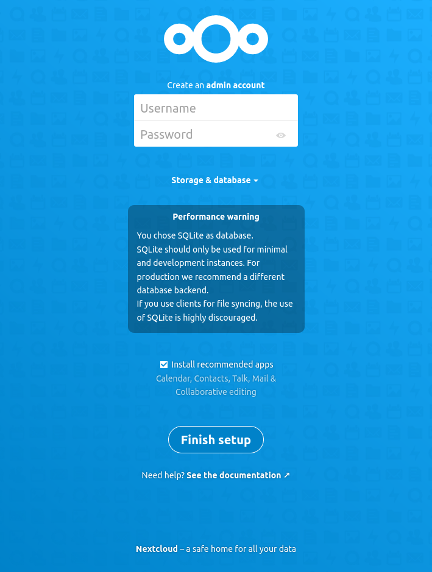

## Nextcloud en LEMP

Partimos de una instalación LEMP (Linux, Nginx, MySQL, PHP):
- [sgz.es/nginx/lemp](/nginx/lemp/)

Vamos a seguir las indicaciones básicas oficiales adaptadas a Nginx y Amazon Linux:
- [Nextcloud ❭ Example installation on CentOS 8](https://docs.nextcloud.com/server/latest/admin_manual/installation/example_centos.html)
- [Nextcloud ❭ NGINX configuration](https://docs.nextcloud.com/server/latest/admin_manual/installation/nginx.html)


**Paquetes PHP:** debes instalar los [requeridos por Nextcloud](https://docs.nextcloud.com/server/latest/admin_manual/installation/source_installation.html#prerequisites-for-manual-installation).

- Incluimos `php-fpm` para que se ejecute como servicio en segundo plano y Nginx le envíe las solicitudes de PHP.

```bash
$ sudo yum install php php-fpm php-gd php-mbstring php-intl php-pecl-apcu \
     php-mysqlnd php-opcache php-json php-zip \
```

Estos paquetes suelen incluirse por defecto, pero asegúrate de tenerlos:
```bash
$ sudo yum install php-dom php-XMLWriter php-XMLReader php-libxml php-SimpleXML
```


Debes adaptar una configuración de Nginx para tu sistema. Tienes un ejemplo en [Nextcloud > NGINX configuration](https://docs.nextcloud.com/server/latest/admin_manual/installation/nginx.html).

Puedes descargar el sigiuente fichero entero [aquí](nextcloud.conf).

```nginx
upstream php-handler {
    # Aquí debes poner la ruta de php-fpm de tu sistema
    # server 127.0.0.1:9000;
    # server unix:/var/run/php/php7.4-fpm.sock;
    server unix:/run/php-fpm/www.sock;
}

server {
    # Escuchamos en el puerto 80 en IPv4 e IPv6
    listen 80;
    listen [::]:80;
    server_name _;   # Responde a cualquier nombre de dominio

    # set max upload size and increase upload timeout:
    client_max_body_size 512M;
    client_body_timeout 300s;
    fastcgi_buffers 64 4K;

    # Enable gzip but do not remove ETag headers
    gzip on;
    gzip_vary on;
    gzip_comp_level 4;
    gzip_min_length 256;

    # [...] Resto de directivas del ejemplo de Nextcloud

    root /var/www/nextcloud;  # Fíjate en este root
}
```

La directiva `root` indica el directorio raíz del servidor virtual de Nginx. Debe coincidir con el directorio donde instales Nextcloud.


El usuario bajo el que se ejecuta el servidor Nginx debe tener los permisos correctos (como mínimo de lectura) en el directorio de instalación de Nextcloud.

Puedes ver el usuario de Nginx en las primeras líneas de `/etc/nginx/nginx.conf`.

El usuario se suele llamar `nginx`.



Siempre que modifiques la configuración de Nginx:
1. Comprueba que no hay errores con un test.
2. Reinicia el servicio.
```bash
$ sudo nginx -t
nginx: the configuration file /etc/nginx/nginx.conf syntax is ok
nginx: configuration file /etc/nginx/nginx.conf test is successful

$ sudo systemctl reload nginx   # Reload es más ligero que restart
```

Si todo ha ido bien, deberías ver la siguiente web poniendo la IP de tu máquina en un navegador:





## Script de instalación

Tienes un script que instala LEMP con Nextcloud [aquí](nextcloud-install.sh).


