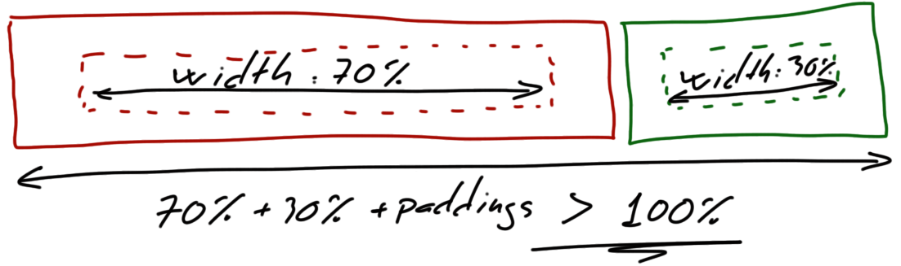
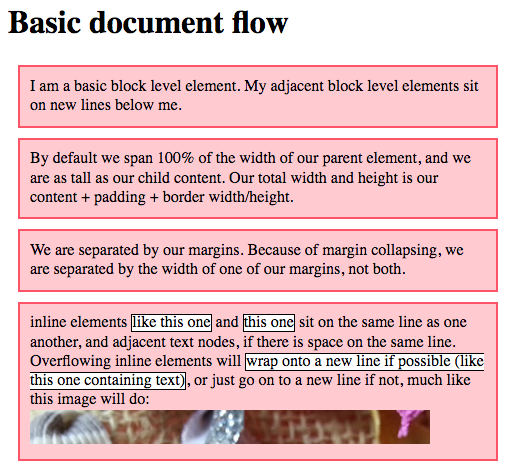

# <!--fit-->CSS, seriously

Diseño de Interfaces Web

###### Santiago González [](https://twitter.com/santi_sgz) [](https://github.com/santigz)

## TOC
— Table Of Contents —

- **Refresher**
- **La cascada!** - orden, especificidad, herencia, reset
- **CSS units** - em, rem, vw, variables
- **Box model** - border-box, margin, ::after

## <!--fit-->Refresher
<!-- _class: invert -->


## Términos


---


## HTML semántico

- Elementos no semánticos: `div`, `span`. No dicen nada sobre el contenido.
- Los elementos semánticos definen el tipo de contenido que incluyen. Son un contenedor igual que `div`, pero hacen automatizable el contenido (ej: lector para ciegos). Úsalos **siempre** que puedas.

Algunos comunes: `main`, `section`, `article`, `nav`, `header`, `aside`, `footer`... [hay unos cuantos](https://www.w3schools.com/html/html5_semantic_elements.asp)

## DOM

**Documento Object Manager:** representación en árbol de un documento HTML.
Un **selector** CSS define el/los nodos sobre los que se aplican sus reglas.


## Selectores

[Ejercicio de selectores](https://frontend30.com/css-selectors-cheatsheet/)

- `a b`, `a, b`
- `a > b`, `a + b`, `a ~ b`
- `a.c`, `a .c`
- `*`, `a *`
- `a :nth-child(2) { }` vs. `a:nth-child(2) { }`
- `a:empty { }`
- `a[class^="btn"]`
Existen [muchos selectores](https://www.quackit.com/css/selectors/)


# <!--fit-->La cascada!
<!-- _class: invert -->


## Hojas de estilo
El _algoritmo de cascada_ decide el valor de cada propiedad en este orden (es [más complejo](https://developer.mozilla.org/en-US/docs/Web/CSS/Cascade#Cascading_order)):

- **User-agent stylesheet:** cada navegador pone su [estilo por defecto](https://stackoverflow.com/a/55215684), ya sea con _.css_ o código.
- **User stylesheet:** el navegador/plugins del navegador pueden alterar el estilo por defecto.
- **Author stylesheet:** <span style="color:mediumorchid">nuestro diseño css.</span>
- `!important`: las marcadas como importantes se sitúan por encima del resto.

## Orden de las reglas
<div style="position: absolute; right: 2em; top: 150px; font-size: 16pt;">
<ul>
    <li><a href="https://www.w3.org/TR/css3-cascade/#cascading">W3: CSS3 Cascading</a></li>
    <li><a href="https://developer.mozilla.org/en-US/docs/Web/CSS/Cascade#Cascading_order">MDN: Cascading</a></li>
<ul>
</div>


## Specifity

Cuando varias reglas se aplican _al mismo elemento_, la cascada decide cuál se aplica según su **especifidad**.

La especifidad es el **peso (_weight_)** de la regla, definido contando el número de ids, clases y etiquetas en el selector. Las pseudo clases (`:link`) cuentan igual.

```
                 ids classes tags weight
p                  0       0    1    1
p.class            0       1    1    11
article p.class    0       1    2    12
article #id        1       0    1    101
```

## Specifity

```html
<nav>
  <a class="elem">Element 1</a>
  <a class="elem" id="myid">Element 2</a>
</nav>
```
```
nav a.elem  { color: yellow; } // weight: 012
nav .elem   { color: blue; }   // weight: 011
nav a#elem  { color: pink; }   // weight: 102
nav #elem   { color: green; }  // weight: 101
a.ele       { color: red; }    // weight: 011
```

Sólo cuando dos reglas tienen el mismo peso, se decide por el **orden en el que aparecen**.


## Estilos _inline_

Escribir CSS de forma inline es una muy mala práctica porque mezclamos contenido y estilo.
Excepción: algunos frameworks JS lo usan mucho.
Si hay inline, no hay selector y se toma con máxima especificidad (_weight = 1000_).
```html
<p style="color: red;">Some text</p>
```


## Problema

¿De qué color se muestra cada párrafo?

```css
#lista p { color: blue; }
.mark { color: red; }
```
```html
<div id="lista">
    <p>Párrafo 1</p>
    <p class="mark">Párrafo 2</p>
</div>
<p class="mark">Párrafo 3</p>
```

¿Cómo lo resolverías?

## Soluciones
1. `.mark { color: red !important; }`<br> No. No. No. No! (a continuación)
2. `#lista .mark {color: red; }`<br>Aumenta la especifidad del hijo (indeseable)
3. `.lista p { color: blue; }`<br>Baja la especifidad del padre con una nueva clase

Mejor la sol. 3: bajar la especifidad da menos problemas.

## Tip: evita `!important`

Un buen diseño NUNCA usa `!important`. Si tienes un problema en la "liga" _normal_, sólo lo trasladas a la liga _important_.

¿Dónde es "aceptable"?
- Si diseñas un tema de WordPress, no uses important.
- Pero si estás usando un tema y quieres reglas por encima sin modificar el código original, puede ser OK.


## Tip: evita IDs (debatible)

- Los IDs tienen especifidad superior a las clases. Para "vencerlas" obligas a usar `!important` o más IDs, dando lugar a [specifity wars](https://stuffandnonsense.co.uk/archives/css_specificity_wars.html).
- **Reusabilidad:** Las clases se pueden reutilizar, pero los IDs deberían ser únicos.
- **Flexibilidad:** Un elemento puede tener varias clases, pero sólo un ID, por lo que es muy limitado.

¿Dónde tiene más sentido? Ej: identificar elementos en JS, pero no para CSS.

## Tip: evita el orden
El código CSS debería poderse refactorizar fácilmente. Si el resultado depende del orden se complica razonar sobre él y los efectos colaterales.
Busca la encapsulación.

Luego vemos cosas feas:
```css
/* !!! NO PONER encima del bloque XXX!!! Bad shit, man. */
.thisclass { /*...*/ }
```

Trabaja con la especifidad en vez del orden.
(hay excepciones)


## Herencia (_inheritance_)

Si un elemento no define una propiedad, es posible que la herede de su ancestro en el DOM.

<p style="color:mediumorchid">Algunas propiedades se heredan por defecto (color, font...) y otras no (padding, margin...).</p>

- El valor `inherit` fuerza la herencia cuando no se aplica por defecto.
- Ej: el user agent [pone los enlaces en azul](https://hg.mozilla.org/mozilla-central/file/3d57107fcf9f/modules/libpref/init/all.js#l212), y nos lo podemos saltar:
```
a { color: inherit; }
```

## Herencia (_inheritance_)
- El valor `initial` hace que no se aplique la herencia, y aplica su valor por defecto (el definido en el estándar CSS, no en el user-agent).
- Usar `all: initial` hace que un elemento bloquee toda la herencia de autor y user-agent, dejando el aspecto original.


## Reseteando el estilo

El _user-agent style_ es diferente entre navegadores (sobre todo en los antigüos), causando inconsistencias.
Es muy frecuente añadir en tu código algo como:

- **CSS reset:** Reescribe TODAS las reglas del user-agent (en código _author_). [Hay muchas formas de reset](https://cssauthor.com/css-reset-stylesheets/).

- **CSS normalize:** para cada navegador, deshace todas las reglas en los que se desvía del estándar, pero el resto no las toca. Se usa mucho [normalize.css](https://necolas.github.io/normalize.css/).

## normalize.css
Es frecuente usar un normalizador y luego un reset propio pequeño para las cosas que necesitamos.

```
<link rel="stylesheet" href="normalize.css" type="text/css">
<link rel="stylesheet" href="myreset.css" type="text/css">
```

Lectura: [Normalize CSS or CSS Reset?!](https://medium.com/@elad/normalize-css-or-css-reset-9d75175c5d1e)
_Tip:_ te puedes descargar el .css o [enlazar un CDN](https://pagecdn.com/lib/normalize)
Los navegadores ahora están más estandarizados
¿Sigue siendo esto necesario? &#129335;

# <!--fit-->CSS units
Pixels, em, rem and stuff...


## Unidades absolutas
Algunas de ellas ([hay más](https://developer.mozilla.org/en-US/docs/Learn/CSS/Building_blocks/Values_and_units#Absolute_length_units))
- `px`: en CSS un pixel **no es un punto de luz**; es independiente de la resolución del monitor (retina display, HiDPI...)
- `mm`: milímetro
- `in`: pulgada
- `pt`: punto —usado en tipografía
```
1 in = 25.4 mm = 72 pt = 96 px
```

## Unidades relativas
Algunas de ellas ([hay más](https://developer.mozilla.org/en-US/docs/Learn/CSS/Building_blocks/Values_and_units#Relative_length_units))
- `em`: tamaño fuente del elemento padre.
- `rem`: tamaño fuente de la raíz del DOM
- `vw`, `vh`: 1% of viewport width/height
- `vmin`, `vmax`: 1% of viewport's smaller/larger dimension

El **computed value** es el valor absoluto resultante de aplicar uno relativo (lo calcula el navegador)

## `em`
Unidad relativa al tamaño del `font-size` del elemento. ([Origen](https://en.wikipedia.org/wiki/Em_(typography)) - tamaño del [tipo M](https://youtu.be/Ca_ywcq8hm0)).
Muy útil para `padding`, `height`, `width`... ya que se escala todo según el tamaño del texto.
```
.block {
  font-size: 16px;
  padding: 0.5em 1em;
  border-radius: 1em;
}
```

<span style="font-size: 16px; padding: 0.5em 1em; border: 1px solid grey; border-radius: 0.5em; display: inline-block;">hola 16px</span> <span style="font-size: 30px; padding: 0.5em 1em; border: 1px solid grey; border-radius: 0.5em; display: inline-block;">hola 30px</span> <span style="font-size: 60px; padding: 0.5em 1em; border: 1px solid grey; border-radius: 0.5em; display: inline-block;">hola 60px</span>

## `em`
Si se usa en el `font-size`, se toma en relación al tamaño heredado del padre.
```html
<p>Hola, esto va <span class="resaltado">más grande</span></p>
```
```
.resaltado {
  font-size: 1.5em;
}
```
<p>Hola, esto va <span style="font-size: 1.5em">más grande</span></p>

## Cuidado con `em`!
Puede descontrolarse en anidaciones:
```
ul { font-size: 0.8em; }
```

<ul>
  <li>Primer nivel
    <ul style="font-size: 0.7em">
       <li>Segundo nivel
         <ul style="font-size: 0.7em">
           <li>Tercer nivel
             <ul style="font-size: 0.7em">
               <li>Cuarto nivel</li>
             </ul>
           </li>
         </ul>
       </li>
    </ul>
  </li>
</ul>

[ver el pen](https://codepen.io/sgz/pen/QWWQrZG)

## `rem` - root _em_
El nodo raíz del DOM es `<html>`, que tiene la pseudo-clase `:root`. Son lo mismo, pero con diferente especificidad (tag vs. class)
`rem` es relativo al `text-size` del root e independiente de todos los padres entre medias.
```css
:root {
  text-size: 1em; // Browser default (16px)
}
p {
  font-size: .8rem;
}
```

## ¿Uso `em` o `rem`?
Normalmente será una combinación de ambos.
En reneral (aprox):
- `rem` para _font-size_ (no siempre!)
- `px` para bordes
- `em` para otras propiedades


## Arquitectura de componentes

<div style="position: absolute; right: 10px; top: 150px; font-size: 16pt; width: 390px;">
Podemos añadir fácilmente clases como <code>small</code>.
<br>
Esto ya parece framework CSS.
<br>
Al usar <code>rem</code>, el panel es independiente de su padre.
</div>

```html
<div class="panel large">
  <h2>Título</h2>
  <p>Lorem ipsum...</p>
</div>
```
```css
.panel {
  font-size: 1rem;    // La clave!
  padding: 1em;       // Depende de font-size
  border: 1px solid #999;
}
.panel > h2 {
  font-size: 1.2em;   // Depende de .panel
  font-weithg: bold;
}
.panel.large {
  font-size: 1.5rem;  // Cambia la clave
}
```
<!--
## Un poco de _responsive_

Un diseño _responsive_ significa que adapta la UI al tamaño de la pantalla (móviles, etc.)
Para esto se usan las **media queries**:
```css
:root {
  font-size: 0.75em;    // Pantalla pequeña
}
@media (min-width: 800px) {
  :root {
    font-size: 0.875em; // Pantalla mediana
  }
}
@media (min-width: 1200px) {
  :root {
    font-size: 1em;     // Pantalla grande
  }
}
```
-->

## `vh` y `vw`


Hacen referencia en % al alto y ancho de la pantalla. Ej:
- Un _above the fold_ que ocupe justo la pantalla.
- Un texto que se ajuste la pantalla. Ej:

```
:root {
  // 1em hace de tamaño mínimo
  font-size: calc(1em + 1vw);
}
```

---
Ejercicio de scroll por "pantallas" en pencode.

```css
background-attachment: fixed;
```

## Valores sin unidad

Algunas propiedades tienen valores numéricos sin unidad: `font-weight` (grosor de la fuente), `z-index` (orden de capas).

`line-height` controla el espaciado entre las líneas de un mismo párrafo, y acepta valores con y sin unidades.
```
section {
  font-weight: 200; // grosor ligero
  line-height: 1.5; // 1.5 * font-size
}
```

## Variables CSS
Es una propiedad que comienza por dos guiones `--`.
- Se pueden usar en elementos que estén por debajo del nodo DOM en el que se definieron.
- Si `var()` tiene dos argumentos, el segundo es el que se usa si la variable no se definió en ningún ancestro.
```css
:root {
  --primary-color: rgb(230, 25, 25);
}
.block {
  color: var(--primary-color);
  color: var(--primary-color, red);
}
```

## Ejemplo
<style scoped>
:root {
  --text-color: #333;
}
.panel {
  all: initial;  /* Don't conflict with Marp theme */
  display: block;
  width: 320px;
  padding: 1em;
  margin: 1em;
  border: 1px solid #ccc;
  border-radius: 4px;
  font-family: Verdana, sans-serif;
  font-size: 16px;
  float: left;
}
.inverted {
  border-width: 0px;  /* NECESARIO después de .panel (esto es malo!) */
  background-color: #111;
  --text-color: #eee;
}
.panel > h2,
.panel > p {
  margin: 0px;
  color: var(--text-color);
}
</style>

A continuación vemos el código para crear estos dos paneles de forma modular.

<div style="width: 800px; margin:auto;">
<div class="panel">
  <h2>Panel normal</h2>
  <p>Lorem ipsum non pariatur quod autem a voluptatem quasi totam voluptas.</p>
</div>
<div class="panel inverted">
  <h2>Panel invertido</h2>
  <p>Lorem ipsum non pariatur quod autem a voluptatem quasi totam voluptas.</p>
</div>
</div>

Puedes consultar también el [código en este pen](https://codepen.io/sgz/pen/LYYOELK)

## Ej: Panel normal
```html
<div class="panel">
  <h2>Hola</h2>
  <p>Lorem ipsum...</p>
</div>
```
```css
:root {
  --text-color: #333;
}
.panel {
  width: 320px;
  border: 1px solid #ccc;
}
.panel > h2,
.panel > p {
  margin: 0px;
  color: var(--text-color);
}
```

## Ej: Panel invertido
La nueva regla CSS tiene más especificidad que `.panel` para que se coja siempre su valor de `border-width` y no dependa del orden del código (no recomendable).
```html
<div class="panel inverted">
  <h2>Hola</h2>
  <p>Lorem ipsum...</p>
</div>
```
```css
div.inverted { /* Más específico que .panel */
  border-width: 0px;
  background-color: #111;
  --text-color: #eee;  /* Redefinición! */
}
```

## CSS y Javascript

Una de las ventajas de las variables CSS es que se pueden modificar desde Javascript y afectan dinámicamente a todos los elementos que las usen.

```js
let root = document.documentElement;
root.style.setProperty('--text-color', "tomato");
```
También se pueden añadir/eliminar clases en _runtime_:
```js
var el = document.getElementById("unElemento");
var cn = el.className; // El valor del atributo class
el.className = cn.concat(" inverted");
```


# <!--fit-->BOX MODEL
<!-- _class: invert -->


## El modelo de caja CSS

CSS box: content, padding, margin, margin.
El background (imagen o color) sólo afecta al content y al padding.


## Problema!

Intenta poner dos cajas **con padding** una al lado de la otra ocupando un ancho de 70% y 30% respectivamente.

```
padding: 20px;
width: 70%;
float: left;
```


¡No cabe en una línea! ¿Soluciones con `calc`?

## `box-sizing`
Hay dos modos de contabilizar el `width` de una caja:
- `box-sizing: content-box` cuenta sólo el contenido (default)
- `box-sizing: border-box`: content, border y padding

Trabajar con `border-box` resulta muy natural, aunque no sea el comportamiento por defecto.

---
<div style="position: absolute; right: 10px; top: 150px; font-size: 16pt; width: 390px;">
Con border-box, el problema de las cajas al 70-30% de anchura con padding resulta trivial, ya que el width ya incluye el padding.
<br>
ver <a href="https://codepen.io/sgz/pen/MWWQXPz?editors=1100">este pen</a>.
</div>


## Ejercicio box-sizing
Aquí no usamos `clear: left` porque sabemos que vamos a llenar dos líneas al 100%, pero es más seguro usarlo para protegernos de posibles problemas.
<p class="codepen" data-height="375" data-theme-id="default" data-default-tab="css,result" data-user="sgz" data-slug-hash="BaaEWre" style="height: 375px; box-sizing: border-box; display: flex; align-items: center; justify-content: center; border: 2px solid; margin: 1em 0; padding: 1em;" data-pen-title="box-size and margins">
  <span>See the Pen <a href="https://codepen.io/sgz/pen/BaaEWre">
  box-size and margins</a> by sgz (<a href="https://codepen.io/sgz">@sgz</a>)
  on <a href="https://codepen.io">CodePen</a>.</span>
</p>
<script async src="https://static.codepen.io/assets/embed/ei.js"></script>


## border-box everywhere
Es frecuente encontrar:
```css
/* Selector *: todos los elementos */
* {
    box-sizing: border-box;
}
```
Mejor aún, esto nos permite "cortar" el uso de border-box en una sub-rama del DOM (imagen siguiente):
```css
:root {
    box-sizing: border-box;
}
* {
    box-sizing: inherit;
}
```
---


## Margin collapsing
Los márgenes verticales (nunca horizontales) de dos cajas juntas se solapan en algunas ocasiones.
- Dos boxes hermanas solapan sus márgenes.
- Un padre y un hijo solapan márgenes si el padre no tiene padding ni margin.
- Una caja vacía con sólo márgenes se solapa por completo con una hermana.
[MDN: Master margin collapsing](https://developer.mozilla.org/en-US/docs/Web/CSS/CSS_Box_Model/Mastering_margin_collapsing)


## Margin collapsing
Hermanos, padre ([pen](https://codepen.io/sgz/pen/XWKEaEY?editors=1100)) y hermano vacío.


Si el padre tiene borde o padding, no se solapa.
Tutorial y codepen: [nanajeon.com/cutup-2-margin](https://nanajeon.com/cutup-2-margin/)

## Margen negativo
**Contact card:** juega con el margen negativo para que este código HTML quede como se muestra.
<!-- Resuelto en https://codepen.io/sgz/pen/zYYWNQK -->
```html
<div class="card">
  <div class="card-top"></div>
  
  <div class="card-body">
    <h2>Lorem Ipsum</h2>
    <p>Non eligendi...<p>
  </div>
</div>
```

<style scoped>
.card {
  position: absolute;
  bottom: 100px;
  right: 20px;
  font-size: initial;
}
.card h2, .card p {
  font-size: initial;
  text-align: left;
  letter-spacing: initial;
  line-height: initial;
  padding: initial;
  margin: initial;
}
.card h2 {
  font-size: 22px;
  margin-bottom: 1.2em;
}
.card {
  width: 300px;
  margin: auto;
  font-family: Helvetica, sans-serif;
  color: #333;
}
.card-top {
  background-color: #A47DA7;
  height: 70px;
  border-radius: 10px 10px 0 0;
}
.card > img {
  display: block;
  background: #504450;
  width: 100px;
  height: 100px;
  border-width: 0;
  border-radius: 50%;
  margin-top: -50px;
  margin-bottom: -50px;
  margin-left: auto;
  margin-right: auto;
  position: relative; /* Para que se aplique el z-index */
  z-index: 1;
}
.card-body {
  background-color: #BEA2C0;
  padding: 2em;
  /* Dejo el espacio de media imagen */
  padding-top: calc(1em + 50px);
  border-radius: 0 0 10px 10px;
}
/* Quito los márgenes de los hijos
   para dejar sólo el padding del card-body.
*/
.card-body :first-child {
  margin-top: 0;
}
.card-body :last-child {
  margin-bottom: 0;
}
</style>

<div class="card">
  <div class="card-top"></div>
  
  <div class="card-body">
    <h2>Lorem Ipsum</h2>
    <p>Non eligendi accusantium qui fugiat ab blanditiis. Impedit mollitia architecto et sequi et itaque molestias. Sed quasi omnis ut soluta.</p>
  </div>
</div>

<!--
## Centrar cosas

En serio, es una locura!


Centrado básico horizontal: márgenes laterales en _auto_
```css
margin-left: auto;
margin-right: auto;
```
[howtocenterincss.com](https://howtocenterincss.com/]
-->


## Propiedad `display`
- `display: inline` continuan la línea si caben. Su ancho se calcula por el contenido, y `width` y `height` no le afectan. Ej: `span`, `img`, `a`...
- `display: block` es como `div`. Comienza siempre en una nueva línea y su tamaño es modificable.
- `display: inline-block` es _inline_ pero sí le afectan `width` y `height`.
- `display: none` como si no estuviera en el DOM.

Muchos más en [w3schools > display property](https://www.w3schools.com/CSSref/pr_class_display.asp)

## Normal flow
El flujo normal del documento está principalmente determinado por el flujo `inline` (sigue la línea) y por el flujo `block` (nueva línea).


## `::before` y `::after`
Son pseudo-elementos (no pseudo-clases, ojo a la especificidad) que se añaden como primer/último hijo.
```
a::after { content: "→" }
```

Es `inline` por defecto.

<style scoped>
a::after {
  content: "";
  display: inline-block;
  background: url(https://image.flaticon.com/icons/svg/25/25284.svg);
  backgroud-repeat: no-repeat;
  background-size: .8em .8em;
  width: .8em;
  height: .8em;
  margin-left: .2em;
}
</style>
Ejemplo de adorno en [enlaces (pen)](https://codepen.io/sgz/pen/LYYdMGz)
Ojo: `::after` (CSS3), `:after` (CSS2)

## Contact card, revisited
El contenedor `card-top` que hicimos no aporta NADA de contenido, por lo que no debería estar en HTML.
```html
<div class="card">
  <div class="card-top"></div> <!-- quitar! -->
  <!-- ... -->
</div>
```
Modifica tu código para usar `::before` ([solución](https://codepen.io/sgz/pen/vYYRvWz)):
```css
.card::before {
  content: "";
  display: block;
  /* ... */
}
```

## Truqui
Puedes añadir un atributo personalizado con texto secundario que se vaya a incluir en _after/before_.
```
<div somedata="Info extra"><!-- ... --></div>
```
```
div::after {
  content: attr(somedata);
}
```
No debería ser contenido importante, ya que no tiene **accesibilidad** y cosas como lectores de HTML no lo entienden.

<!--test-->

<!--
##
```
LOVE button
```
caniuse.com
https://images.guide/
-->

## Clearfix
Es muy frecuente usar esta técnica para "limpiar" una zona flotante.
```css
.clearfix::after {
  content: "";     /* Necesario para que se añada */
  display: block;  /* Hace que ocupe una línea entera */
  clear: both;     /* Limpia los flotantes */
}
```
```html
<div class="clearfix">
    <!-- Contenidos flotantes -->
</div>
<!-- Aquí ya se ha limpiado el float! -->
```

## Ejemplo clearfix
<p class="codepen" data-height="363" data-theme-id="default" data-default-tab="html,result" data-user="sgz" data-slug-hash="RwwmmGq" style="height: 363px; box-sizing: border-box; display: flex; align-items: center; justify-content: center; border: 2px solid; margin: 1em 0; padding: 1em;" data-pen-title="clearfix">
  <span>See the Pen <a href="https://codepen.io/sgz/pen/RwwmmGq">
  clearfix</a> by sgz (<a href="https://codepen.io/sgz">@sgz</a>)
  on <a href="https://codepen.io">CodePen</a>.</span>
</p>
<script async src="https://static.codepen.io/assets/embed/ei.js"></script>


## Clearfix
Esta técnica resuelve el problema del tamaño del padre con contenidos flotantes, que no influyen en el tamaño del padre.
Añadimos al padre un último hijo `::after` con un clear de los flotantes (ver [pen](https://codepen.io/sgz/pen/jOrpeYB)).


## float vs inline-block
Con ambas se puede conseguir el mismo efecto.
Float se creó para colocar imágenes flotantes dentro de un texto, y sigue siendo adecuado.
<p class="codepen" data-height="265" data-theme-id="default" data-default-tab="html,result" data-user="sgz" data-slug-hash="wvvLgEq" style="height: 265px; box-sizing: border-box; display: flex; align-items: center; justify-content: center; border: 2px solid; margin: 1em 0; padding: 1em;" data-pen-title="float:left text">
  <span>See the Pen <a href="https://codepen.io/sgz/pen/wvvLgEq">
  float:left text</a> by sgz (<a href="https://codepen.io/sgz">@sgz</a>)
  on <a href="https://codepen.io">CodePen</a>.</span>
</p>
<script async src="https://static.codepen.io/assets/embed/ei.js"></script>

Para hacer una vista en mosaico actualmente es más adecuado usar _flexbox_.

## Position
Elemento _no posicionado_ (por defecto):
```
position: static;
```
Elemento posicionado:
```
position: relative;
position: absolute;
position: fixed;
position: sticky;
```
Las propiedades `top`, `bottom`, `left`, `right` y `z-index` sólo se aplican a elementos posicionados.

<div style="position: absolute; right: 40px; top: 400px; font-size: 20pt; width: 300px;">
Muy visual en:<br><a href="https://developer.mozilla.org/en-US/docs/Web/CSS/position">MDN > position</a>
</div>

## position: relative
Por sí mismo no cambia la localización del elemento, pero _"activa"_ las propiedades `top`, `bottom`, `left` y`right` para mover el elemento respecto a su posición original.
- Los demás elementos no se ven afectados en nada.


## position: absolute
- El resto de elementos se colocan como si el absoluto no existiese.
- Puedes usar `top`, `bottom`, `left` y`right` .
<p style="color:mediumorchid">La posición es respecto al <u>primer padre que esté posicionado</u> (no <code>static</code>), o el <code>body</code> en su defecto.</p>


## absolute + relative
Es muy frecuente usar `absolute` dentro de `relative`.
- El elemento relativo hace de canvas, y su ubicación es la normal.
- Los elementos absolutos se sitúan dentro del canvas con facilidad.
```html
<div class="relativo">
  <div class="absoluto">
    <!-- Posicionado respecto a "relativo" -->
  </div>
</div>
```

## position: fixed
El elemento se sitúa fijo respecto al _viewport_, no a la página.
- No hace scroll con el resto de la página. Se queda "flotando".
- Ej: Botón de ir al inicio de la página
<p class="codepen" data-height="265" data-theme-id="default" data-default-tab="css,result" data-user="sgz" data-slug-hash="ZEEdJNb" style="height: 265px; box-sizing: border-box; display: flex; align-items: center; justify-content: center; border: 2px solid; margin: 1em 0; padding: 1em;" data-pen-title="position: fixed">
  <span>See the Pen <a href="https://codepen.io/sgz/pen/ZEEdJNb">
  position: fixed</a> by sgz (<a href="https://codepen.io/sgz">@sgz</a>)
  on <a href="https://codepen.io">CodePen</a>.</span>
</p>
<script async src="https://static.codepen.io/assets/embed/ei.js"></script>


## position: sticky
Se integra en su sitio habitual como `relative`, pero si el scroll lo saca del viewport con los valores `top`, `bottom`, `left`, `right`, actúa como `fixed`.
<p class="codepen" data-height="265" data-theme-id="default" data-default-tab="html,result" data-user="sgz" data-slug-hash="mddZBpv" style="height: 265px; box-sizing: border-box; display: flex; align-items: center; justify-content: center; border: 2px solid; margin: 1em 0; padding: 1em;" data-pen-title="position: sticky">
  <span>See the Pen <a href="https://codepen.io/sgz/pen/mddZBpv">
  position: sticky</a> by sgz (<a href="https://codepen.io/sgz">@sgz</a>)
  on <a href="https://codepen.io">CodePen</a>.</span>
</p>
<script async src="https://static.codepen.io/assets/embed/ei.js"></script>
Muchíííííísimo más eficiente que hacerlo por JS.


## Ejercicio subrayado posicionado con ::after
<p class="codepen" data-height="287" data-theme-id="default" data-default-tab="html,result" data-user="sgz" data-slug-hash="jOOoovV" style="height: 287px; box-sizing: border-box; display: flex; align-items: center; justify-content: center; border: 2px solid; margin: 1em 0; padding: 1em;" data-pen-title="underline::after">
  <span>See the Pen <a href="https://codepen.io/sgz/pen/jOOoovV">
  underline::after</a> by sgz (<a href="https://codepen.io/sgz">@sgz</a>)
  on <a href="https://codepen.io">CodePen</a>.</span>
</p>
<script async src="https://static.codepen.io/assets/embed/ei.js"></script>


## z-index
Orden CSS en el que se pintan los elementos:
1. Tags posicionados con `z-index` negativos
2. Tags no posicionados `position: static` (default)
3. Tags posicionados con `z-index: auto` (default)
4. Tags posicionados con `z-index` positivos

- A igual _"capa"_ se pintan según el orden HTML.
Coger con pinzas de momento, porque para entenderlo bien hay que hablar de _stacking contexts_.


# Ejercicios

---
<!-- backgroundColor: #e5eff1 -->


<!--
<p class="codepen" data-height="265" data-theme-id="default" data-default-tab="css,result" data-user="sgz" data-slug-hash="YzzmNEm" style="height: 265px; box-sizing: border-box; display: flex; align-items: center; justify-content: center; border: 2px solid; margin: 1em 0; padding: 1em;" data-pen-title="card simple">
  <span>See the Pen <a href="https://codepen.io/sgz/pen/YzzmNEm">
  card simple</a> by sgz (<a href="https://codepen.io/sgz">@sgz</a>)
  on <a href="https://codepen.io">CodePen</a>.</span>
</p>
<script async src="https://static.codepen.io/assets/embed/ei.js"></script>
-->

---
<!-- backgroundColor: #abc -->

<!--
<p class="codepen" data-height="265" data-theme-id="default" data-default-tab="css,result" data-user="sgz" data-slug-hash="pooXpyQ" style="height: 265px; box-sizing: border-box; display: flex; align-items: center; justify-content: center; border: 2px solid; margin: 1em 0; padding: 1em;" data-pen-title="card Feynman">
  <span>See the Pen <a href="https://codepen.io/sgz/pen/pooXpyQ">
  card Feynman</a> by sgz (<a href="https://codepen.io/sgz">@sgz</a>)
  on <a href="https://codepen.io">CodePen</a>.</span>
</p>
<script async src="https://static.codepen.io/assets/embed/ei.js"></script>
-->


## Tools
- [CSS matic](https://www.cssmatic.com/)
    - Gradient Generator
    - Border Radius
    - Noise Texture
    - Box Shadow


