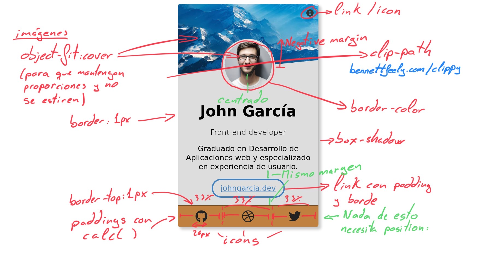
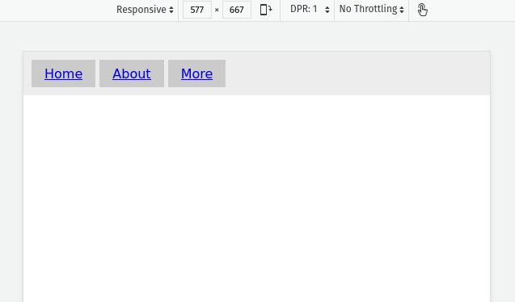
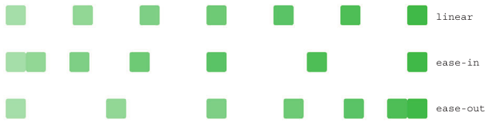
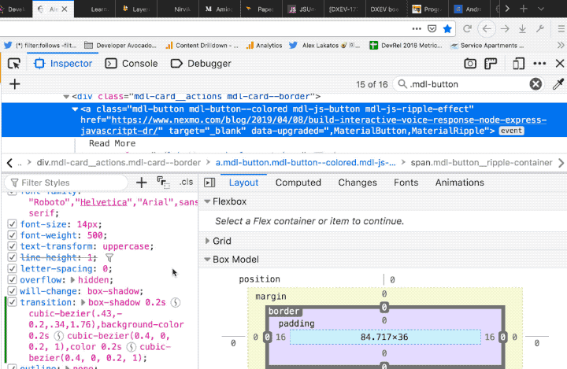
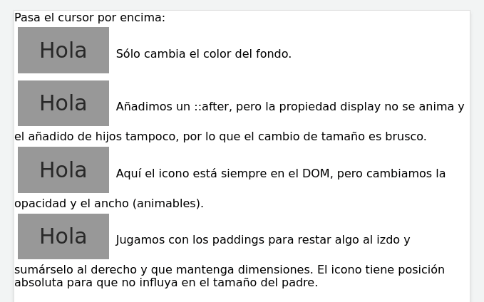
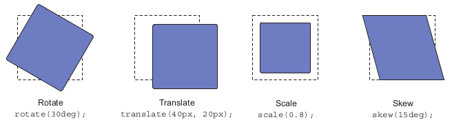

# <!--fit-->CSS miscelanea

Diseño de Interfaces Web

###### Santiago González [](https://twitter.com/santi_sgz) [](https://github.com/santigz)

## TOC

- Vendor prefixes
- Background
- Gradients
- Shadows
- Links and buttons
- Navigation bar
- Fuentes, icons
- Media queries, dark mode


## Vendor prefixes

Es un sistema para probar nuevas implementaciones experimentales en CSS hasta que se estabiliza y se lanza oficialmente.

```css
-webkit-transition: all 4s ease;
-moz-transition: all 4s ease;
-ms-transition: all 4s ease;
-o-transition: all 4s ease;
transition: all 4s ease;
```

También hay mucho [drama sobre vendor prefixes](https://css-tricks.com/tldr-on-vendor-prefix-drama/).
Considera el uso de [autoprefixer](https://autoprefixer.github.io/) o similar.

## Can I use ...?
Un gran problema en diseño web es el soporte a navegadores: diversos y anticuados.

EL SITIO para consultar: caniuse.com


## Background

La propiedad `background` es compleja y son realmente 8 propiedades:

```css
background-attachment
background-clip
background-color
background-image
background-origin
background-position
background-repeat
background-size
```

[Ver MDN > background](https://developer.mozilla.org/en-US/docs/Web/CSS/background)


## Gradients

```css
background: linear-gradient(to right, black, red);
```
Ver docs [MDN linear-gradient](https://developer.mozilla.org/en-US/docs/Web/CSS/linear-gradient)

<style>
.bgr {
	width: 100%;
	height: 100px;
	float: left;
	font-size: .6em;
}
.bgr1 { background: linear-gradient(to right, red, orange 30%, yellow 50%, green 70%, blue); }
.bgr2 { background: linear-gradient(to right, red 20%, orange 20% 40%, yellow 40% 60%, green 60% 80%, blue 80%); }
</style>
<div class="bgr bgr1"></div>
<div class="bgr bgr2"></div>

```css
linear-gradient(to right, red, orange 30%, yellow 50%, green 70%, blue);
linear-gradient(to right, red 20%, orange 20% 40%,
                yellow 40% 60%, green 60% 80%, blue 80%);
```

cssgradient.io

## Shadows

```css
text-shadow: offset-x offset-y radius color;
box-shadow: off-x off-y radius spread color;
```

```css
box-shadow: 5px 5px gray;
box-shadow: inset 5px 5px gray;
box-shadow: inset 5px 5px red, 5px 5px gray;
```

Se pueden especificar varias sombras separadas por comas. [w3schools](https://www.w3schools.com/csS/css3_shadows.asp), [MDN](https://developer.mozilla.org/en-US/docs/Web/CSS/box-shadow)

<style>
.boxshadow {
	color: white;
	background-color: black;
	padding: .5em;
	margin-bottom: 20px;
}
</style>
<div style="position: absolute; right: 30px; top: 100px; font-size: 16pt;">
<p style="text-shadow: .1em .1em .1em #999; font-weight: 800;"><strong>Text shadow</strong></p>
<p style="text-shadow: 0 0 3px #999; font-weight: 800;"><strong>Text shadow</strong></p>
<div class="boxshadow" style="box-shadow: 5px 5px gray;">Box shadow</div>
<div class="boxshadow" style="box-shadow: 5px 5px 5px gray;">Box shadow</div>
<div class="boxshadow" style="box-shadow: 5px 5px 5px 7px gray;">Box shadow</div>
<div class="boxshadow" style="box-shadow: inset 0 5px 5px #999, 5px 5px 5px gray; border-radius: 1em;">Inset and out</div>
</div>


## Links

Pseudoclases posibles para un enlace:

```css
a:link {}
a:visited {}
a:hover {}
a:active {}
a:focus {}
```


## Buttons

Pseudoclases posibles para un botón:

```css
button:hover {}
button:focus {} /* Importante */
button:active {}
button:visited {}
```

Nunca quites el focus a botones/links, ya que desorienta el uso del tabulador.

Jamás `button:focus { outline: 0; }`


## Links and buttons

La mejor guía ever:

css-tricks.com/a-complete-guide-to-links-and-buttons

Estúdiatela!


## Links and buttons

Atención a:
- Roles ARIA (accesibilidad)
- Enlaces en tarjetas enteras
- [Breakout buttons](https://css-tricks.com/breakout-buttons/) (botones en tarjetas)
- Estilos de focus `button:focus {}`


## Navigation bar

En HTML debería ser una lista por motivos SEO.

```html
<nav>
  <ul>
    <li><a href="/">Home</a></li>
    <li><a href="/about">About</a></li>
    <li><a href="/contact">Contact</a></li>
  </ul>
</nav>
```

Los `li` tienen `display: list-item` por defecto.
Comienza cambiando esto para dar estilo a un menú de navegación.

---

Ejemplo básico con submenús.

<p class="codepen" data-height="265" data-theme-id="dark" data-default-tab="css,result" data-user="sgz" data-slug-hash="yLJwyPP" style="height: 265px; box-sizing: border-box; display: flex; align-items: center; justify-content: center; border: 2px solid; margin: 1em 0; padding: 1em;" data-pen-title="Drop down menu (minimal)">
  <span>See the Pen <a href="https://codepen.io/sgz/pen/yLJwyPP">
  Drop down menu (minimal)</a> by sgz (<a href="https://codepen.io/sgz">@sgz</a>)
  on <a href="https://codepen.io">CodePen</a>.</span>
</p>
<script async src="https://static.codepen.io/assets/embed/ei.js"></script>


## Fuentes e iconos

En el notion de clase.


## Ejercicio


## Ejercicio


## Ejercicio


## Media queries

Fundamental en el diseño responsivo.

Permite incluir bloques de reglas css condicionales.
- Se suele jugar con el orden del código
- Ojo con la especificidad de reglas dentro y fuera de las media queries.

```css
/* if viewport width > 600px */
@media (max-width: 600px) {
  body {
    background-color: lightblue;
  }
}
```

---

css-tricks.com/a-complete-guide-to-css-media-queries
- css-tricks.com/logic-in-media-queries
- [MDN @media](https://developer.mozilla.org/en-US/docs/Web/CSS/@media)

```css
@media screen and (min-width: 600px) {}
@media (min-width: 401px) and (max-width: 800px) {} /* and */
@media (max-width: 600px), (min-width: 800px) {}    /* or  */

```

Media types: `all`, `print`, `screen`, `speech`.


---

Mobile first:
```css
html { background: red; }

@media (min-width: 600px) {
  html { background: green; }
}
```

Desktop first:
```css
html { background: red; }

@media (max-width: 600px) {
  html { background: green; }
}
```

<div style="position: absolute; right: 30px; top: 100px; width: 300px; font-size: 16pt;">
<p>Con las media queries sí que jugamos con el orden del código casi siempre.
</p>
</div>


## Ejercicio
Menú responsivo




# Dark mode!
<!-- _class: invert -->

css-tricks.com/a-complete-guide-to-dark-mode-on-the-web

```css
@media (prefers-color-scheme: dark) {}
```

<p class="codepen" data-height="361" data-theme-id="light" data-default-tab="css,result" data-user="sgz" data-slug-hash="JjKweKM" style="height: 361px; box-sizing: border-box; display: flex; align-items: center; justify-content: center; border: 2px solid; margin: 1em 0; padding: 1em;" data-pen-title="Dark mode">
  <span>See the Pen <a href="https://codepen.io/sgz/pen/JjKweKM">
  Dark mode</a> by sgz (<a href="https://codepen.io/sgz">@sgz</a>)
  on <a href="https://codepen.io">CodePen</a>.</span>
</p>
<script async src="https://static.codepen.io/assets/embed/ei.js"></script>


## Transiciones

Formato de la propiedad:
```css
transition: <property> <duration> <function> <delay>;
```
```css
transition: all 0.25s ease-in 0s;   /* Unidad 's' obligatoria */
transition: background-color 0.3s linear 0.5s;
```

Para especificar varias propiedades a la vez:
```css
transition: background 0.2s ease,
            padding 0.8s linear;
```

[MDN](https://developer.mozilla.org/en-US/docs/Web/CSS/transition), [css-tricks](https://css-tricks.com/almanac/properties/t/transition/) | [Lista de propiedades animables](https://developer.mozilla.org/en-US/docs/Web/CSS/CSS_animated_properties)


## Transciones

Dos formas de establecer propiedades:
```css
transition: border-radius 0.3s linear, background-color 0.6s ease;

/* Equivalente a: */
transition-property: border-radius, background-color;
transition-duration: 0.3s, 0.6s;
transition-timing-function: linear, ease;
transition-delay: 0s, 0s;
```


## Funciones de transición

Funciones predefinidas: `linear | ease | ease-in | ease-out | ease-in-out`



Para depurar usa el [inspector de animaciones](https://developer.mozilla.org/en-US/docs/Tools/Page_Inspector/How_to/Work_with_animations)!


## Funciones de transición

También puedes definir curvas de bezier personalizadas. Usa el [inspector de desarrollo](https://alexlakatos.com/devtricks/2019/04/13/firefox-devtools-tricks-inspector/).




## Ejercicio

Animaciones en botones (pen)




## Transformaciones

```css
transform: rotate(90deg);
transform: rotate(90deg) translate(20px, 5px);
```




Para profundizar:
- 3dtransforms.desandro.com


## Otra forma de centrar

```css
div {
    position: absolute;
    top: 50%;
    left: 50%;
    transform: translate(-50%, -50%);
}
```

- Pone el origen del div (esquina superior izda) en el centro vertical y horizontal
- Traslada el objeto para que el centro del mismo se mueva a la esquina superior izda

