# <!--fit-->CSS Layout
<h1 style="color: #d82d2d">Flexbox & Grid</h1>

Diseño de Interfaces Web

###### Santiago González [](https://twitter.com/santi_sgz) [](https://github.com/santigz)

# <!--fit-->Intro
<!-- _class: invert -->

## Historia del layout web

Se han pasado por varias etapas muy diferentes:

grid-layout.com/history.html

- HTML: Table layout
- HTML: Frames
- CSS: position y floats
- CSS: flexbox
- CSS: grid

## Dinosaurios

Genial artículo que explica la evolución del layout:
[Modern CSS Explained For Dinossaurs](https://medium.com/actualize-network/modern-css-explained-for-dinosaurs-5226febe3525)


<!-- Más sobre [historia de diseño web](https://www.webdesignmuseum.org/web-design-history). -->

Vamos a seguir esta página. Mira el codigo y codepens que pone el autor.

Resuelve de varias maneras el [Holy Grail](https://en.wikipedia.org/wiki/Holy_grail_(web_design)).

---
Página sin layout, sólo contenido y algo de estilo básico.

 

## Float-based layout

Es difícil conseguir igual altura entre floats.

```css
main, nav, aside { position: relative; float: left; }
footer { clear: both; }
```


## Flexbox

Se activa simplemente en la propiedad `display: flex`, y es mucho más, _ejem_, flexible que los floats.

Reduce código y consigue alineamiento vertical!


---


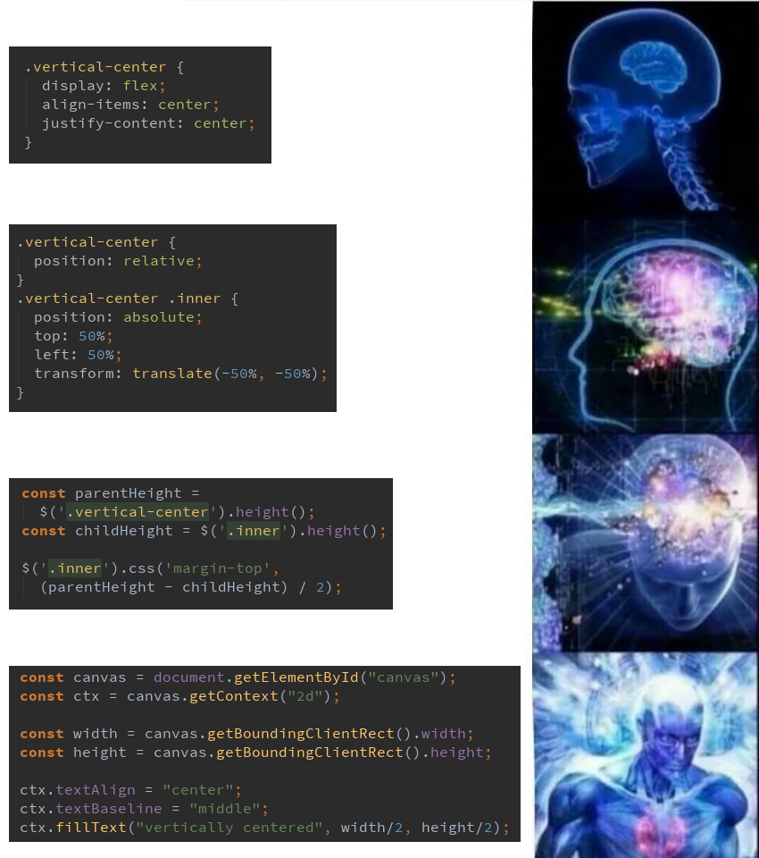


## Grid
Crea una rejilla y permite colocar divs en sus celdas.

Se activa con `display: grid`. caniuse.com/css-grid


# <!--fit-->Flexbox
<!-- _class: invert -->
_Flexible Box Layout_

## Guías

- [css-tricks A Complete Guide To Flexbox](https://css-tricks.com/snippets/css/a-guide-to-flexbox/)
- [Interneting is hard. Flexbox](https://www.internetingishard.com/html-and-css/flexbox/)
- [MDN (Mozilla) Conceptos Básicos de flexbox](https://developer.mozilla.org/es/docs/Web/CSS/CSS_Flexible_Box_Layout/Conceptos_Basicos_de_Flexbox)
- [w3schools CSS Flexbox](https://www.w3schools.com/csS/css3_flexbox.asp)


## Basics
Si un div se define como `display: flex`, se convierte en un _flex container_, y sus hijos en _flex items_.

- Los hijos se colocan a lo largo del eje principal.
- El eje principal por defecto es el horizontal, pero se puede cambiar a vertical.


<a style="position:absolute; bottom: 20px; font-size: 16pt" src="https://css-tricks.com/snippets/css/a-guide-to-flexbox/">css-tricks.com/snippets/css/a-guide-to-flexbox</a>

## Ejemplo flex
Menú de navegación con elementos a los lados. Usa flex y `margin-left: auto`.

<p class="codepen" data-height="338" data-theme-id="default" data-default-tab="html,result" data-user="sgz" data-slug-hash="eYNpQWg" style="height: 338px; box-sizing: border-box; display: flex; align-items: center; justify-content: center; border: 2px solid; margin: 1em 0; padding: 1em;" data-pen-title="Bootstrap menu">
  <span>See the Pen <a href="https://codepen.io/sgz/pen/eYNpQWg">
  Bootstrap menu</a> by sgz (<a href="https://codepen.io/sgz">@sgz</a>)
  on <a href="https://codepen.io">CodePen</a>.</span>
</p>
<script async src="https://static.codepen.io/assets/embed/ei.js"></script>


## Alineación

Propiedades `justify-content` y `align-items`:
 

---

Para practicar, un juego: www.flexboxdefense.com

En serio, sólo son 12 niveles. Hazlos todos.

<!--- https://csslayout.io/ -->


## Centrado horizontal y vertical

<p class="codepen" data-height="436" data-theme-id="default" data-default-tab="css,result" data-user="sgz" data-slug-hash="ExjZZKO" data-preview="true" style="height: 436px; box-sizing: border-box; display: flex; align-items: center; justify-content: center; border: 2px solid; margin: 1em 0; padding: 1em;" data-pen-title="Flex: centrado">
<span>See the Pen <a href="https://codepen.io/sgz/pen/ExjZZKO">
Flex: centrado</a> by sgz (<a href="https://codepen.io/sgz">@sgz</a>)
on <a href="https://codepen.io">CodePen</a>.</span>
</p>
<script async src="https://static.codepen.io/assets/embed/ei.js"></script>

## Flex items

En los hijos de un contenedor flex, se puede definir:
```css
.hijo-1 { flex: 1; }
.hijo-2 { flex: 2; }
.hijo-3 { flex: 1; }
```

Esto hace que del espacio del padre, los hijos ocupen proporciones en 1-2-1 resp.

## Propiedad `flex`

Esta propiedad es en realidad un conjunto de tres:
```css
flex: flex-grow flex-shrink flex-basis|auto|initial|inherit;
```

- `flex-basis`: tamaño inicial del elemento (px, %...) Es lo que ocupa "por defecto".
- `flex-grow`: indica cómo pueden crecer un hijo por encima del tamaño base para rellenar el espacio sobrante en el padre.
- `flex-shrink`: lo mismo, pero para reducir el tamaño padre si el contenedor reduce su tamaño.

## Ejemplos

<p class="codepen" data-height="288" data-theme-id="default" data-default-tab="html,result" data-user="sgz" data-slug-hash="xxGZjoN" style="height: 288px; box-sizing: border-box; display: flex; align-items: center; justify-content: center; border: 2px solid; margin: 1em 0; padding: 1em;" data-pen-title="Flex sizes">
  <span>See the Pen <a href="https://codepen.io/sgz/pen/xxGZjoN">
  Flex sizes</a> by sgz (<a href="https://codepen.io/sgz">@sgz</a>)
  on <a href="https://codepen.io">CodePen</a>.</span>
</p>
<script async src="https://static.codepen.io/assets/embed/ei.js"></script>


## Grow y shrink
No son porcentajes, sino "partes". No llevan unidad.

Al activar `flex-grow`, los hijos se expanden para rellenar el ancho del padre, y se reparten el espacio de relleno en las proporciones que indiques.


Shrink es equivalente para contraer los hijos.

---
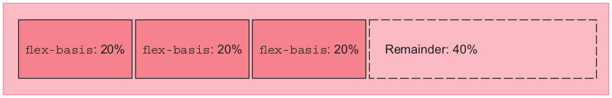
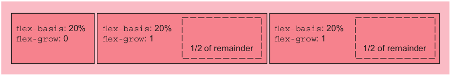


## Grow y shrink
Con lo siguiente hacemos que hijo1 crezca 3 veces más rápido que hijo2.
```css
.padre { display: flex }
.hijo1 { flex-grow: 3 }
.hijo2 { flex-grow: 1 }
```

Esto no hace que el tamaño de hijo1 sea 3 veces más grande (eso es `flex-basis`), sino el reparto del espacio sobrante para rellenar el padre, que es la rapidez de crecimiento.


## Grow y shrink
Grow y srhink indican proporciones, por lo que los siguientes ejemplos son idénticos.
```css
.hijo1 { flex-grow: 6 }
.hijo2 { flex-grow: 2 }

.hijo1 { flex-grow: 30 }
.hijo2 { flex-grow: 10 }
```

## Media queries

Fundamental en el diseño responsivo.

Permite incluir bloques de reglas css condicionales.
- Se suele jugar con el orden del código
- Ojo con la especificidad de reglas dentro y fuera de las media queries.

```css
@media only screen and (max-width: 600px) {
  body {
    background-color: lightblue;
  }
}
```


## Responsive meta tag

Indica al navegador que la página es responsive y deshabilita la simulación de escritorio.

```html
<head>
  <meta charset="UTF-8">
  <meta name="viewport" content="width=device-width, initial-scale=1">
  <title>...</title>
</head>
```

- [MDN > Viewport meta tag](https://developer.mozilla.org/en-US/docs/Mozilla/Mobile/Viewport_meta_tag)
- Codepen no lo incluye por defecto: _settings > HTML > Stuff for head_

---

Diferencia entre no incluir la meta tag. En Firefox hay que activar _touch simulation._

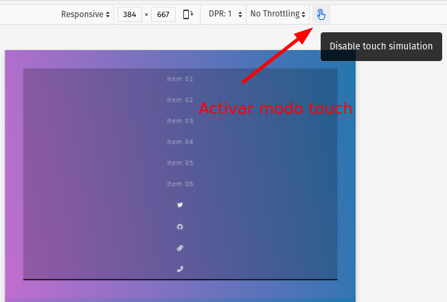 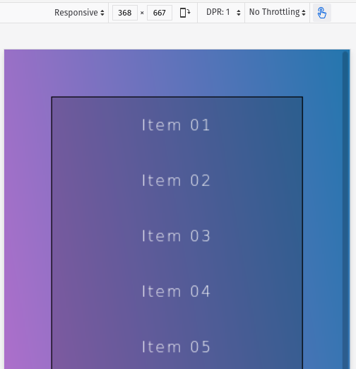


## Menú básico
Usando flex y una media query, con Sass.
<p class="codepen" data-height="374" data-theme-id="default" data-default-tab="css,result" data-user="sgz" data-slug-hash="BaNKJeL" data-preview="true" style="height: 374px; box-sizing: border-box; display: flex; align-items: center; justify-content: center; border: 2px solid; margin: 1em 0; padding: 1em;" data-pen-title="Flex nav">
<span>See the Pen <a href="https://codepen.io/sgz/pen/BaNKJeL">
Flex nav</a> by sgz (<a href="https://codepen.io/sgz">@sgz</a>)
on <a href="https://codepen.io">CodePen</a>.</span>
</p>
<script async src="https://static.codepen.io/assets/embed/ei.js"></script>

## Wrapping
Permite que los hijos salten a la siguiente línea **si sus tamaños base superan al padre.**
- Si hay wrapping, se desactiva el shrink.
- Recuerda que `flex: 1` deja el tamaño base a 0, por lo que no habría wrapping. Hay que dar `flex-basis` a los hijos.


---

<p class="codepen" data-height="411" data-theme-id="default" data-default-tab="css,result" data-user="sgz" data-slug-hash="ExjZNzp" data-preview="true" style="height: 411px; box-sizing: border-box; display: flex; align-items: center; justify-content: center; border: 2px solid; margin: 1em 0; padding: 1em;" data-pen-title="Flex wrap">
<span>See the Pen <a href="https://codepen.io/sgz/pen/ExjZNzp">
Flex wrap</a> by sgz (<a href="https://codepen.io/sgz">@sgz</a>)
on <a href="https://codepen.io">CodePen</a>.</span>
</p>
<script async src="https://static.codepen.io/assets/embed/ei.js"></script>

Prueba wrapping con diferentes valores de `justify-content`.

## Dirección y orden

Para ello jugamos con las propiedades `flex-direction` en el padre y `order` en los hijos.


## Ejemplo menú de navegación

Este ejemplo está adaptado de flexbox.io (la web no es oficial de flexbox). El videotutorial no está mal. Usamos iconos de [FontAwesome v5](https://fontawesome.com/).

<p class="codepen" data-height="265" data-theme-id="default" data-default-tab="css,result" data-user="sgz" data-slug-hash="PoqWwrV" data-preview="true" style="height: 265px; box-sizing: border-box; display: flex; align-items: center; justify-content: center; border: 2px solid; margin: 1em 0; padding: 1em;" data-pen-title="Flex nav - enunciado">
<span>See the Pen <a href="https://codepen.io/sgz/pen/PoqWwrV">
Flex nav - enunciado</a> by sgz (<a href="https://codepen.io/sgz">@sgz</a>)
on <a href="https://codepen.io">CodePen</a>.</span>
</p>
<script async src="https://static.codepen.io/assets/embed/ei.js"></script>

---
Hacemos que `ul` sea contenedor flex. Nos deja un espacio sobrante a la derecha.
```css
.flex-nav ul {
  /* ... */
  display: flex;
}
```
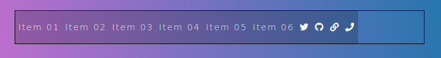

---
Hacemos que los hijos rellenen todo, dando a los items sociales la tercera parte del espacio de relleno. Se podrían elegir otros selectores con más especificidad.
```css
.flex-nav li {
  flex: 3;
}
.flex-nav .social {
  flex: 1;
}
```
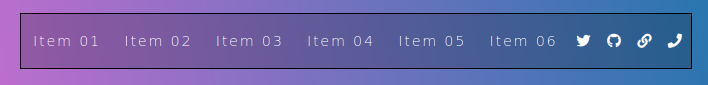

---
<style scoped>
section {
  font-size: 20pt;
}
</style>

Hacemos una vista para tamaño medio con una media query y wrapping.
```css
@media all and (max-width:700px) {
  .flex-nav ul {
    flex-wrap: wrap;
  }

/* Si no tiene suficiente especifidad,
   no se aplica! */
  .flex-nav li {
    flex-basis: 50%;
  }

/* Esta regla se puede quitar porque
   los iconos sociales si tienen tamaño 0
   se expanden por igual al tener flex-grow: 1 */
  .flex-nav .social {
    flex-basis: 25%;
  }
}
```
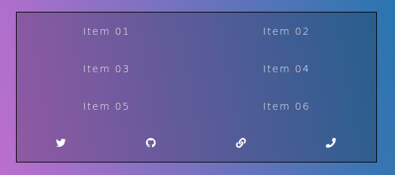

---
Vista pequeña.
```css
@media all and (max-width:400px) {
  .flex-nav li {
    flex-basis: 100%;
  }
}
```

<!-- Ejercicio resuelto entero [en este pen](https://codepen.io/sgz/pen/ZEGLGYp) -->

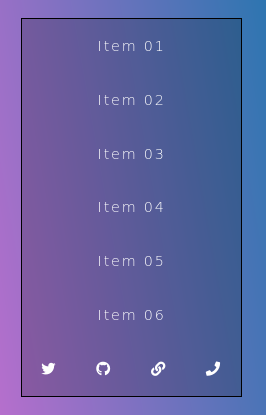


## Ejercicio: nav en página

Este ejercicio incluye el menú anterior en una página. Parte del siguiente código:

<p class="codepen" data-height="265" data-theme-id="default" data-default-tab="html,result" data-user="sgz" data-slug-hash="KKpawYw" data-preview="true" style="height: 265px; box-sizing: border-box; display: flex; align-items: center; justify-content: center; border: 2px solid; margin: 1em 0; padding: 1em;" data-pen-title="Flex nav page - enunciado">
<span>See the Pen <a href="https://codepen.io/sgz/pen/KKpawYw">
Flex nav page - enunciado</a> by sgz (<a href="https://codepen.io/sgz">@sgz</a>)
on <a href="https://codepen.io">CodePen</a>.</span>
</p>
<script async src="https://static.codepen.io/assets/embed/ei.js"></script>

---
Tamaño grande con menú del ejercicio anterior.
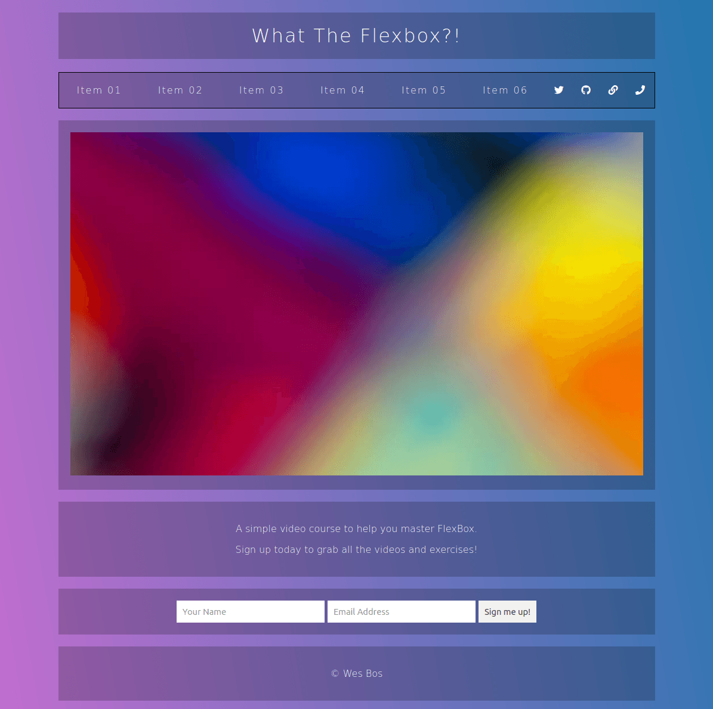

---
Tamaño medio con menú del ejercicio anterior.
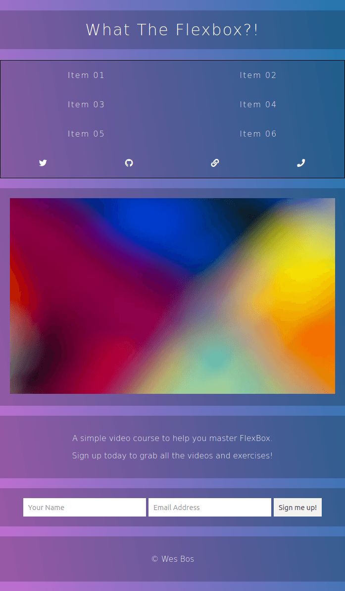

---
Tamaño pequeño con menú en parte superior.
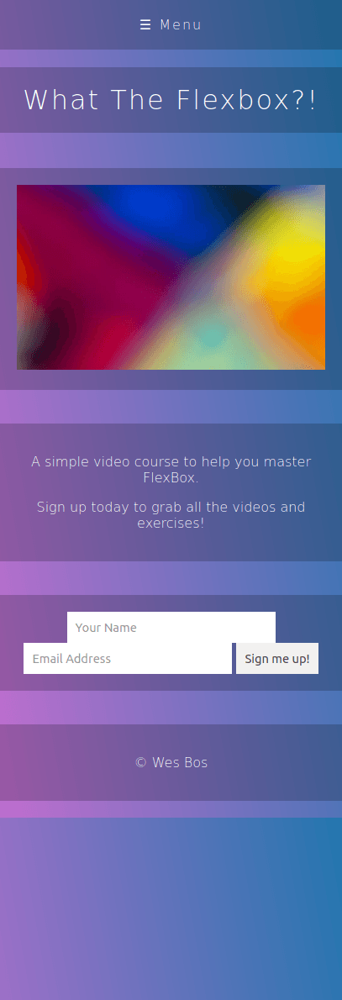 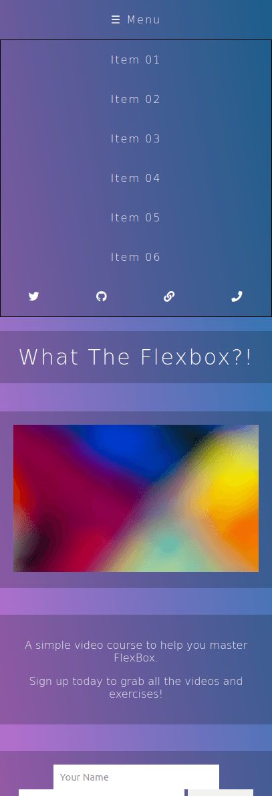

---
Ten en cuenta:
- El `wrapper` será un flexbox en vertical.
- Los flex items (hijos) por defecto tienen orden 0, por lo que para subir el menú deberás darles un orden alto a todos excepto al menú.
- Incluye jQuery con el código del ejemplo.
- El código jQuery lo que hace es añadir/quitar la clase `open` a `.flex-nav ul`. Deberás mostrar/ocultar el menú cuando esta clase esté presente o no.

## Solución

<!--
<p class="codepen" data-height="500" data-theme-id="light" data-default-tab="css,result" data-user="sgz" data-slug-hash="GRJrJZe" style="height: 500px; box-sizing: border-box; display: flex; align-items: center; justify-content: center; border: 2px solid; margin: 1em 0; padding: 1em;" data-pen-title="Flex nav page - resuelto">
  <span>See the Pen <a href="https://codepen.io/sgz/pen/GRJrJZe">
  Flex nav page - resuelto</a> by sgz (<a href="https://codepen.io/sgz">@sgz</a>)
  on <a href="https://codepen.io">CodePen</a>.</span>
</p>
<script async src="https://static.codepen.io/assets/embed/ei.js"></script>
-->

