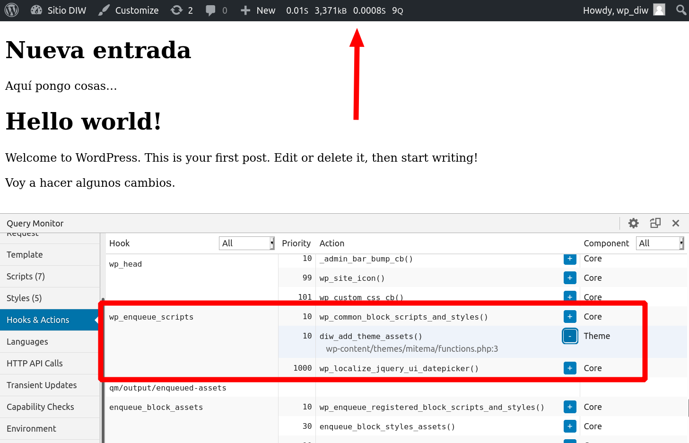

# <!--fit-->Wordpress

Diseño de Interfaces Web

###### Santiago González [](https://twitter.com/santi_sgz) [](https://github.com/santigz)


## Instalación

- Servidor web (Apache, Nginx...)
- PHP 7.4 ([extensiones PHP para WP](https://make.wordpress.org/hosting/handbook/handbook/server-environment/#php-extensions))
- MySQL / MariaDB
- https://wordpress.org/latest.tar.gz
    - Mira la estructura de directorios
    - `wp-config.php`
    - `wp-content/themes/`
    - `wp-content/plugins/`


## Admin panel

Por defecto la ruta para entrar al panel de administración es: **[host]/wp-admin**

Si no has usado WordPress, familiarízate con la creación de posts, páginas, subida de archivos, configuración básica, etc.


## Referencia para creación de temas

- Documentación oficial: https://developer.wordpress.org/themes
- La tradicional sigue siendo muy buena: https://codex.wordpress.org/Theme_Development


## Tema mínimo en blanco

Crea un nuevo directorio:

ej: `wordpress/wp-content/themes/mitema/`

Dos ficheros requeridos:
- `index.php`: plantilla principal (en blanco ahora)
- `style.css`: Añade el [comentario en bloque con la metainformación esencial](https://developer.wordpress.org/themes/basics/main-stylesheet-style-css/#basic-structure)

Activa el tema desde el admin panel.


## Depurar temas

[Debugging in WordPress](https://wordpress.org/support/article/debugging-in-wordpress/)

En el fichero de configuración `wp-config.php`:

```php
define( 'WP_DEBUG', true );     // Busca y pon a true
define( 'WP_DEBUG_LOG', true ); // Añade esta línea
// Log en wp-content/debug.log
```

En el admin panel, instala el plugin [Query monitor](https://wordpress.org/plugins/query-monitor/)


## Lectura

Secciones de
https://developer.wordpress.org/themes/

- [/getting-started/](https://developer.wordpress.org/themes/getting-started/)
- [/basics/template-files/](https://developer.wordpress.org/themes/basics/template-files/)
- [/basics/main-stylesheet-style-css/](https://developer.wordpress.org/themes/basics/main-stylesheet-style-css/)
- [/basics/template-hierarchy/](https://developer.wordpress.org/themes/basics/template-hierarchy/)
- [/basics/organizing-theme-files/](https://developer.wordpress.org/themes/basics/organizing-theme-files/)


## Conceptos básicos de admin

- Admin panel > Settings > **Permalinks**
- **Slug**: nombre de un post en la URL, ej: `miweb.com/titulo-sin-espacios-sin-tildes`
- [Excerpt](https://wordpress.org/support/article/excerpt/) (resúmen del post)
- [Categories vs. Tags](https://wordpress.com/support/posts/categories-vs-tags/)


## Un post es más que un post

Internamente en WP, hay varios [tipos de `post`](https://developer.wordpress.org/themes/basics/post-types/):

- **Post** (Post Type: `post`)
- **Page** (Post Type: `page`)
- **Attachment** (Post Type: `attachment`)
- **Revision** (Post Type: `revision`)
- **Navigation menu** (Post Type: `nav_menu_item`)
- ...


## Explorar la DB y los tipos de posts en uso

Modificar la DB puede no ser la mejor idea, pero investigar el funcionamiento sí que lo es!

```sql
$ mysql -u DB_USER -p

> use WP_DATABASE;
> show tables;
> select post_type, post_title from wp_posts;
```


## The Loop (básico)

Es el bucle principal que recorre la lista de posts.

[Doc > The Loop](https://developer.wordpress.org/themes/basics/the-loop)

```php
if ( have_posts() ) {
  while ( have_posts() ) {
    the_post(); // Extrae atributos del post actual

    // Acceder a atributos del post
    the_title();
  }
}
```

[Info accesible desde el loop](https://developer.wordpress.org/themes/basics/the-loop/#what-the-loop-can-display)


## Theme partials

Tienes que crear algunos ficheros que contendrán partes del HTML final que se construye.

Algunos de ellos son:

- `header.php`
- `footer.php`
- `sidebar.php`

[Doc > Template Files > Theme partials](https://developer.wordpress.org/themes/basics/template-files/#template-partials)


## Header

Crea un fichero llamado `header.php` en tu tema con el doctype, etiqueta `<head>` y apertura de `<body>`.

[Ejemplo básico de header.php](https://codex.wordpress.org/Theme_Development#Document_Head_.28header.php.29)

**Importante:** incluye siempre una llamada a `wp_header()`, que es donde Wordpress mete el código de cabecera de plugins.


## Header

El `header.php` se ejecuta donde uses la llamada a `get_header()` en el `index.php` u otros ficheros.

Debería ser lo primero que ejecute el `index.php`, antes del Loop.


## Footer

Similar al header, crea `footer.php` cerrando `</body>` y `</html>`, además de lo que quieras incluir en el footer de tu sitio web.

[Ejemplo básico de footer.php](https://codex.wordpress.org/Theme_Development#Footer_.28footer.php.29)


## Header, loop, footer

Ejemplo básico de `index.php` con lo visto:
```php
get_header();
if ( have_posts() ) {
  while ( have_posts() ) {
    the_post();
    the_title('<h1>', '</h1>');
  }
}
get_footer();
```


## Sintaxis alternativa

Más en [Codex > The Loop](https://codex.wordpress.org/The_Loop)

```php
<?php if (have_posts()): while (have_posts()): the_post(); ?>
  <article>
    <h1><?php the_title(); ?></h1>
    <main><?php the_content(); ?></main>
  <article>
<?php endwhile; else: ?>
  <p>There are no entries</p>
<?php endif; ?>
```


## Template Hierarchy
[Docs > Template Hierarchy](https://developer.wordpress.org/themes/basics/template-hierarchy/)
wphierarchy.com


## Template Hierarchy

- La única plantilla imprescindible es `index.php`
- Se ejecuta la plantilla más específica que se encuentre. Fallback: `index.php`
- Ej: si tenemos `home.php`, el cargar la portada, se ejecuta ese fichero en vez de `index.php`
- Desde cada template debemos llamar a `get_header()` y `get_footer()`
- WordPress lee la URL y construye la query adecuada. The Loop sólo recorre lo que corresponde para esa URL.


## Validation & Sanitization

**Validation:** comprobar datos de entrada. Respuesta binaria: válido/no válido.

**Sanitization:** Modificar los datos para eliminar inseguridades.

WP tiene funciones para [validation](https://developer.wordpress.org/themes/theme-security/data-validation/) y para [sanitization](https://developer.wordpress.org/themes/theme-security/data-sanitization-escaping/)


## Sanitization

Hay funciones `sanitize-*()`:

Ej: `sanitize_title()` para un slug ([doc](https://developer.wordpress.org/reference/functions/sanitize_title/))

Y funciones de escapado `esc_*()`:

```html
<?php echo esc_html( $title ); ?>
" />
<a href="#" onclick="<?php echo esc_js( $custom_js ); ?>">Click</a>
<ul class="<?php echo esc_attr( $stored_class ); ?>"> </ul>
<ul class="<?php echo esc_attr( $stored_class ); ?>"> </ul>
<textarea><?php echo esc_textarea( $text ); ?></textarea>
```

Ver [documentación](https://developer.wordpress.org/themes/theme-security/data-sanitization-escaping/)


## Sanitization

Las funciones de WP como `the_permalink()` ya tienen sanitization.

Ver [documentación](https://developer.wordpress.org/reference/functions/the_permalink/) !y código fuente!


## Functions

El fichero especial `functions.php` contiene todas las funciones que pueden ser accesibles desde cualquier fichero template. Ej:

```php
// functions.php:
function mytheme_post_meta() {
  echo '<time datetime="' . get_the_date('c') . '">' .
        get_the_date() . "</time>";
  echo 'By ' . get_the_author();
}
// index.php:
mytheme_post_meta();
```


## Functions

Organiza tu código. Ej:

```php
// functions.php:
require_once('lib/helpers.php');

// lib/helpers.php:
function mytheme_post_meta() { /*...*/ }

// index.php:
mytheme_post_meta();
```

Usa siempre el mismo prefijo para todas tus funciones. Requerido para vender temas en wordpress.org/themes o themeforest.net


## Hooks

Permiten que un tema/plugin interactúe con el core de WP. También podemos crear hooks propios.

- **Action hooks:** para añadir callbacks en puntos específicos de WP.
- **Filter hooks:** para modificar datos en ciertos puntos.

[Ver documentacón](https://developer.wordpress.org/plugins/hooks/)


## Hook para añadir nuestro CSS/JS

Vamos a incluir nuestro `style.css` en el `<head>`.

**No se hace así:**
```php
// header.php
<html><head>
  <link rel="stylesheet" href="style.css">
```

Sigue...

----

Debes usar un action hook en `functions.php`:
```php
function mytheme_add_theme_assets() {
  wp_enqueue_style('mytheme-style',    // Identificador único
    get_template_directory_uri() . '/style.css');
  wp_enqueue_script('mytheme-script',
    get_template_directory_uri() . '/script.js');
}
add_action('wp_enqueue_scripts', 'mytheme_add_theme_assets');
```

Cuando WP vaya a incluir todos sus scripts, ejecutará todas las funciones que se hayan registrado en la acción [wp_enqueue_scripts](https://developer.wordpress.org/reference/hooks/wp_enqueue_scripts/).

Esto ocurre dentro de `wp_head()` que debes tener en tu `header.php`.


---

En nuestra cabecera podemos ver que ahora aparece:
```php
<link rel='stylesheet' id='diw-style-css'
      href='http://localhost/wp-content/themes/mitema/style.css?ver=5.6'
      type='text/css' media='all' />
```

¿Por qué añade `?ver=5.6`? Por defecto pone la versión de tu WP. Si cambia, se fuerza a los navegadores a refrescar la caché.
Puedes poner una version a mano, o hacer [que cambie cada vez que se modifique el fichero css](https://wordpress.stackexchange.com/a/247965)
```php
// Mira la documentación: 4º parámetro
wp_enqueue_style($handle, $src, $deps, $version);
```

## Action priority

El orden en el que se ejecutan todas las acciones registradas a una acción se puede alterar con un parámetro opcional extra:

```php
add_action('wp_enqueue_scripts', 'mytheme_add_theme_assets', 5);

// Forma rápida de registrar al final:
add_action('wp_enqueue_scripts', 'mytheme_add_theme_assets',
           PHP_INT_MAX);
```

## Otros action hooks

Se usan para cualquier interacción con WP. Ej:

```php
// Callback al accionar el botón
function diw_dentro_admin() {
  echo '<h1>Hola</h1>';
}
// Esto añade un menú en el panel de admin
function diw_custom_menu() {
  add_menu_page('Page Title', 'Mi Botón, 'edit_posts',
		'menu_slug', 'diw_dentro_admin');
}
add_action('admin_menu', 'diw_custom_menu');
```

Aquí tienes la [documentación de todas las Actions](https://codex.wordpress.org/Plugin_API/Action_Reference)


## Crear una action propia

Es frecuente y útil crear acciones propias en las que se pueden registrar acciones.

```php
// functions.php u otros ficheros incluidos
function mytheme_hook1() { /*...*/ }
add_action('mytheme_action', 'mytheme_hook1');

function mytheme_hook2() { /*...*/ }
add_action('mytheme_action', 'mytheme_hook2');

// index.php
do_action('mytheme_action');
```


## Depurar con Query Monitor

Este plugin usa [acciones para logging](https://querymonitor.com/docs/logging-variables/)

```php
do_action( 'qm/debug', 'This happened!' );
```

Esto es mejor que usar métodos estáticos como:
```php
// Si no tengo instalado el plugin,
// PHP detiene la ejecución con error fatal!
QM::error( 'Everything is broken' );
```


---
Puedes revisar los hooks ejecutados y sus prioridades con Query Monitor.



# <!--fit-->Recapitulando
<!-- _class: invert -->

- Tipos de posts
- Depuración WP_DEBUG y plugins
- Explora la documentación, el código y la DB de WP
- The Loop, header, footer
- Template hierarchy (index.php y otros)
- Validation & Sanitization
- functions.php
- Action hooks


## Contenidos para testing

Importa los contenidos de: wptest.io


## Revisa lo visto

Estúdiate la sección entera de https://developer.wordpress.org/themes/basics/


## Pagination

Para que aparezca la paginación ([ver doc](https://developer.wordpress.org/themes/functionality/pagination/))

```php
<?php the_posts_pagination(); ?>
```

Para cambiar el título (mira la documentación de [the_posts_pagination](https://developer.wordpress.org/reference/functions/the_posts_pagination/))
```php
<?php the_posts_pagination(array('screen_reader_text' => 'Mi paginación')); ?>
```


## Sidebar

El siguiente código en tu plantilla `index.php` para que aparezca la sidebar por defecto:
```php
<?php get_sidebar(); ?>
```

Modifica tu HTML y scss para que se muestre como desees.


## Widgets en el sidebar

Puedes crear un área de sidebar donde el admin pueda añadir los widgets que desee. [Ver doc](https://developer.wordpress.org/themes/functionality/sidebars/)

```php
function diw_sidebar_widgets() {
  register_sidebar(array(
    'id'            => 'primary-sidebar',
    'name'          => esc_html( 'Primary Sidebar', 'diw' ),
    'description'   => esc_html( 'Este es mi sidebar', 'diw' ),
    'before_widget' => '<aside id="%1$s" class="widget %2$s">',
    'after_widget'  => '</aside>',
    'before_title'  => '<h3 class="widget-title">',
    'after_title'   => '</h3>',
  ));
}
add_action('widgets_init', 'diw_sidebar_widgets');
```

---

Ahora debería aparecer automáticamente el menú de admin: _Appearance > Widgets_

Y tu sidebar debería aparecer si en `index.php` incluyes el sidebar por defecto:

```php
<?php get_sidebar(); ?>
```

---

Pero no hemos cargado el sidebar con nombre `primary-sidebar`.

Para ello, crea el fichero `sidebar.php` con lo siguiente:

```php
<aside>
<?php dynamic_sidebar('primary-sidebar'); ?>
</aside>
```

Ahora ya deberías ver los widgets que tú añadas desde el panel de admin.


## Search form

En `index.php`:

```php
<?php get_search_form(); ?>
```

Puedes insertar tu propio código en vez del que genera por defecto creando el fichero `searchform.php`.
Mira [la documentación](https://developer.wordpress.org/reference/functions/get_the_posts_pagination/).


## Menus

- Tu tema registra uno o varios menús con IDs.
- El admin crea menús que luego puede "enganchar" en tus IDs (o no).
- Tu tema decide dónde se sitúa cada menú.

Para registrar dos menús (hazlo dentro del hook `after_setup_theme` ([ej](https://developer.wordpress.org/themes/basics/theme-functions/)) o `init` ([ej](https://developer.wordpress.org/themes/functionality/navigation-menus/))):
```php
register_nav_menus( array(
  'primary'   => 'Menú Primario',
  'secondary' => 'Menú Secundario'
));
```

---

Para situar un menú (ej `header.php`, `index.php`...):
```php
<?php wp_nav_menu( array( 'theme_location' => 'primary' ) ); ?>
```

Revisa [la documentación](https://developer.wordpress.org/themes/functionality/navigation-menus/)


## Retomando The Loop

Para comprender mejor The Loop y personalizarlo:

notion.sgz.es

