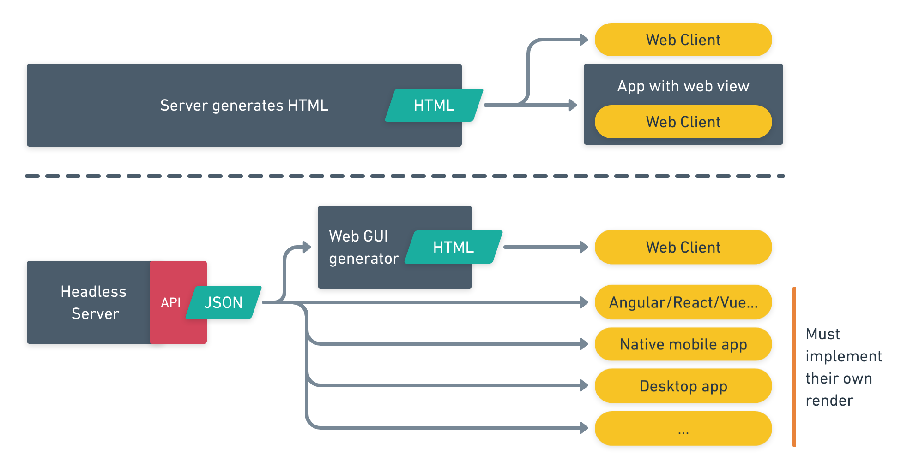

# <!--fit-->Ghost

Diseño de Interfaces Web

###### Santiago González [](https://twitter.com/santi_sgz) [](https://github.com/santigz)

## <!--fit-->Intro a Node.js
<!-- _class: invert -->

---
**Node.js** es un runtime de JavaScript:
- Usado en aplicaciones web server, daemons y utilidades cli.
- Usa el motor de JavaScript V8 de Google (ECMAScript 2015 = ES6).

**JavaScript** se llama técnicamente ECMAScript:
- No tiene concurrencia (_single-threaded_).
- _Non-blocking I/O_: basado en eventos y callbacks.
- [What the heck is the event loop anyway? Philip Roberts](https://www.youtube.com/watch?v=8aGhZQkoFbQ)


## NPM

Node Package Manager `npm` es el gestor del repositorio de Node.js.

- `npm install <pkg>` instalación local en `./node_modules` (lo habitual).
- `npm install -g <pkg>` instalación global en el sistema, frecuente para herramientas de consola.

Configuración principal del proyecto: `package.json`

## <!--fit-->Hello World!
Servidor básico en Node.js y Express

## Esqueleto

```bash
mkdir example
cd example
npm init -y     # Crea package.json
```
Echa un vistazo a `package.json`.
Añadimos una dependencia:
```bash
npm install --save express
```
Guarda el código descargado en `node_modules`.
`--save` actualiza por nosotros `package.json`

## `package.json`
Tiene la configuración principal del proyecto.
```json
  "dependencies": {
    "express": "^4.17.1"
  }
```
Guarda el nombre y versión de todas las dependencias.
```bash
rm -rf node_modules   # Borramos todas las dependencias instaladas
npm install           # Lee package.json y las instala
```
-> Nunca subas `node_modules` al repositorio!!!

## `index.js`

```js
const express = require('express');
const app = express();
const port = 3000;

app.get('/', (req, res) => {
  res.send('Hello World');
});

app.listen(port, () => {
  console.log(`Available at localhost: ${port}`);
});
```
Ejecútalo con `node index.js`.
Pruébalo en el navegador y con `curl`.

## Debug

Node.js usa el Chrome Debugging Protocol:
`node inspect index.js`

Abre Chrome: `chrome://inspect` > _Open dedicated DevTools for Node_

<!--
## Node scripts
`package.json` puede contener scripts para automatizar comandos complejos (pueden tener cualquier nombre):
```json
"scripts": {
  "start": "node index.js",
  "debug": "node debug index.js",
  "test": "echo \"Error: no tests specified\" && exit 1"
}
```

Se pueden ejecutar con npm:
```bash
$ npm start
$ npm debug
$ npm test
```
-->


## Node.js vs. PHP
MUY diferente de PHP en el servidor:
- En PHP es frecuente escribir páginas:
`http://dir/dir/file.php` => Nginx => PHP file
Al terminar, el proceso PHP finaliza.
- Node es un servidor JS que ejecuta tu app.
El proceso Node arranca y debe mantenerse activo.


## Rutas (routes)
En PHP las rutas las decidimos según los (sub)directorios donde dejamos el código.

En Node la localización del código no influye en las rutas, que definimos explícitamente con Express. Controlamos explícitamente el acceso a las rutas y los métodos HTTP (GET, POST, PUT, DELETE...)
Queda clara la API de nuestra aplicación.

```js
app.get('/') {}
app.get('/authors') {}
app.delete('/author/:nombre') {}
app.put('/file/:fname') {}
```

## Template engines
Permiten introducir datos desde JS en plantillas HTML (lo vimos con Jekyll/Liquid).
Algunas populares:
- Pug
- Mustache
- Handlebars
- Marko
- EJS

## Ejemplo con Handlebars
```bash
mkdir ej-hbs
cd ej-hbs
npm install -y
npm install --save express hbs

# Copiar ficheros siguientes index.js y views/index.hbs
node index.js
```

---
`index.js`:
```js
const app = require('express')();
const path = require('path');

// Set template engine to search in ./views directory
app.set('views',path.join(__dirname,'views'));
app.set('view engine','hbs');

app.get('/',(req,res)=>{
  const datos = {
    nombre: 'Aycaramba!',
    intereses: ['Turrón', 'Hummus', 'Brócoli'] };

  // Render the template with the data
  res.render('index', datos);
});
app.listen(3000);
```


---
`./views/index.hbs`:
```html
<!DOCTYPE html>
<head>
    <title>Ayyyy</title>
</head>
</body>
    <h1>Hola!</h1>
    <p>Nombre: {{nombre}}</p>
    <p>Intereses:</p>
    <ul>
        {{#each intereses}}
        <li>{{this}}</li>
        {{/each}}
    </ul>
</body>
</html>
```

## <!--fit-->Ghost
<!-- _class: invert -->

## Ghost CMS

Inicialmente (2013-17):
> The professional publishing platform

Ahora (2018-):
> The #1 open source headless Node.js CMS

- :heavy_check_mark: open source
- :heavy_check_mark: CMS (Content Management System)
- :heavy_check_mark: Node.js
- :x:  ¿qué es headless?


## Headless

En el modelo tradicional de sitio web, el CMS (WordPress, Joomla...) construye las páginas front-end HTML/CSS/JS y las entrega al cliente.

- Poco flexible. Acopla contenidos al front-end
- ¿Y si quiero front-end nativo, no web?

*Headless* => desacopla contenidos y front-end con una API, generalmente en JSON.

- [Ghost Content API](https://ghost.org/docs/setup/)
- [Ghost Admin API](https://ghost.org/docs/api/v3/admin/)


## Headles



## Ghost

Al ser headless, se puede usar para frontends más elaborados en Angular/React/Vue...

Pero también puede ser... ¿headful? Tradicional. Con un frontend generado en el backend.

Para ello usa un **template engine** como Handlebars.

## Instalar Ghost

Necesita Node.js y una DB:

- MySQL si es instalación en producción.
```
ghost install
```

- SQLite para desarrollo, poco eficiente pero sin configuración.
```
ghost install local
```

Guía [How to install Ghost locally](https://ghost.org/docs/install/local/).

## Ghost Handlebars Themes

Visita siempre la [documentación oficial de Ghost](https://ghost.org/docs/api/v3/handlebars-themes/)

Este canal de YouTube te puede ser muy útil, ya que va paso a paso (ojo que es para Ghost v1, y estamos en v3).
- [How to Create Ghost Themes](https://www.youtube.com/watch?v=TQMBPW9U2so&list=PLtKjv92L0ihBBXGz7iCdtTkvdD0dXXy78)
- Tu instalación incluye el tema `contents/themes/casper`. Échale un vistazo también si te surgen dudas de cómo se hace algo.

## Estructura principal

[Ghost theme structure](https://ghost.org/docs/api/v3/handlebars-themes/structure/):
```text
ghost/contents/themes/your-theme
├── /assets
│   ├── /css
│   │   └── style.css
│   ├── /fonts
│   └── /images
├── default.hbs
├── index.hbs [required]
├── post.hbs [required]
└── package.json [required]
```
Crea los ficheros, sigue [Ghost package.json](https://ghost.org/docs/api/v3/handlebars-themes/packagejson/) y activa el tema desde el panel de administrador.

## `index.hbs`

```
{{!< default}}  <!--Usa la "plantilla" default.hbs-->
<header>
  <h1 class="page-title">{{@site.title}}</h1>
  <h2 class="page-description">{{@site.description}}</h2>
</header>

<main role="main">
<ul>
  {{#foreach posts}} <!--Bucle de posts-->
    <!--Dentro del scope de post usamos sus variables-->
    <li><a href={{url}}>{{title}}</a></li>
  {{/foreach}}
</ul>
{{pagination}}
</main>
```

## Explicación

- Handlebars tiene una función de bucle `each`, pero en Ghost no se debería usar nunca, ya que han creado `foreach`, [que se integra mejor](https://ghost.org/docs/api/v3/handlebars-themes/helpers/foreach/).
- `{{#foreach posts}}` recorre todos los posts, y dentro del bucle se crea un **scope** o ámbito con [las variables que tiene un post](https://ghost.org/docs/api/v3/handlebars-themes/helpers/foreach/).
- Recorrer así los posts ya tiene en cuenta la configuración de la paginación del `packages.json` en tu tema:`"posts_per_page": 5`

## `default.hbs`

Contiene el esquema HTML principal del sitio.

```html
<!DOCTYPE html>
<html>
<head>
    <title>{{@site.title}}</title>
    <link rel="stylesheet" type="text/css"
        href="{{asset "assets/screen.css"}}" />
    {{ghost_head}} <!--Añade metadatos y SEO-->
</head>
<body class="{{body_class}}">
    {{{body}}} <!--Contenidos dentro de la plantilla-->
    {{ghost_foot}} <!--Añade otros scripts importantes-->
</body>
</html>
```

## Data Helpers

Ghost tiene variables especiales como:
- `@config` tiene datos de tu tema, del _config_ en `package.json` de tu tema. [Ver docs](https://ghost.org/docs/api/v3/handlebars-themes/helpers/config/).
- `@site` tiene datos generales del sitio, configurables desde el panel de administración. [Ver docs](https://ghost.org/docs/api/v3/handlebars-themes/helpers/site/).

## Data Helpers

Revisa los [Data Helpers de Ghost](https://ghost.org/docs/api/v3/handlebars-themes/helpers/data/): (post, url, autores, twitter...)

Ej: para el menú de navegación principal:
```hbs
<ul>
  {{#foreach navigation}}
    <li class="nav-{{slug}}{{#if current}} nav-current{{/if}}">
      <a href="{{url absolute="true"}}">{{label}}</a>
    </li>
  {{/foreach}}
</ul>
```

## Partials

Los partials son una función básica de Handlebars. Si guardo un fichero (ej `ejemplo.hbs`) **en el directorio especial `partials`**, puedo incluirlo con:
```hbs
{{> ejemplo}}
<!--También se pueden pasar parámetros-->
{{> ejemplo par1="unacosa" par2="otracosa"}}
```
Las variables de Data Helpers son accesibles desde cualquier partial y no hace falta pasarlas como parámetros.

## Utility Helpers

Hay varios [Utility Helpers](https://ghost.org/docs/api/v3/handlebars-themes/helpers/utility/) interesantes:

- `{{asset img/icon.png}}` gestiona muy bien los ficheros (úsalo siempre! para imágenes, css...). Además añade `?v=####` automático para gestionar la caché en el cliente hasta que el asset cambie.
- `{{ghost_head}}` y `{{ghost_footer}}` añaden código importante. Ponlos en `default.hbs`.

## CSS y Ghost

Ghost añade ciertas clases para facilitar el CSS. Ej:

```hbs
<!--En default.hbs-->
<body class={{body_class}}>
```

Esto añade una clase diferente según la página que se esté renderizando: `home-template`, `post-template`, `page-template`... [ver todas](https://ghost.org/docs/api/v3/handlebars-themes/helpers/body_class/)

Usa esas clases en tu CSS si quieres un selector que se refiera a una página en concreto.

## CSS y Ghost
También hay clases especiales para un post:
```hbs
<article class="{{post_class}}">
  {{content}}
</article>
```
Puede añadir las clases (ninguna, una o varias):
`post`, `featured`, `page`, `tag-:slug` con el slug adecuado.

El _slug_ es el nombre de la página en la URL: `https://example.com/post/<slug>`

## CSS y Ghost: el editor

Los usuarios escriben en Ghost en Markdown. Ghost lo convierte a HTML, e incluye unas clases concretas que indican cómo ha configurado el usuario los contenidos, para que tu tema lo estile correctamente.

- Imágen `<figure>`, pie de imagen y tamaño
- Galería de imágenes
- Bookmark card
- Embed card

La [documentación del editor](https://ghost.org/docs/api/v3/handlebars-themes/editor/) ayuda mucho.

---
Esta es la lista completa de clases que tu tema debe incluir con Ghost v3 para que sea correcto:
```css
.kg-width-wide {}
.kg-width-full {}
.kg-gallery-container {}
.kg-gallery-row {}
.kg-gallery-image {}
.kg-bookmark-card {}
.kg-bookmark-container {}
.kg-bookmark-content {}
.kg-bookmark-title {}
.kg-bookmark-description {}
.kg-bookmark-metadata {}
.kg-bookmark-icon {}
.kg-bookmark-author {}
.kg-bookmark-publisher {}
.kg-bookmark-thumbnail {}
```

## Gscan

Ghost incluye un validador de temas. ¡Ú-sa-lo!

```bash
npm install -g gscan

# Si estoy en el directorio del tema
gscan

# O pasándole la ruta del tema
gscan contents/themes/mitema
```

